# Elektrostatické pole
## Elektrický náboj
- je fyzikální veličina (skalární) 
- vyjadřuje vlastnost částic, která je spojována se vznikem silového vzájemného působení mezi tělesy či částicemi 
- může vzniknout třením 
- je nezničitelný 
- je vázán na jednotku hmoty
- značí se Q 
	- $Q=I*t$
		- $I$ je proud
		- $t$ je čas
- jednotkou elektrického náboje je Coulomb [C] 
	- $C=A*s$
		- Zápis v jednotkách
		- $A$ je Ampér
		- $s$ je sekunda
- Pro velikost náboje v akumulátorech se používá jednotka [As] či [Ah]
	- $1C=1As$
	- $1Ah=3600C$
- Nejmenší možná velikost náboje se nazývá **elementární náboj** 
- Velikost elementárního náboje je rovna elektrickému náboji elektronu:
	- $e=\pm1.609\cdot10^{-19}C$
- Náboj může být: 
	- kladný (proton) 
	- záporný(elektron) 
- opačně nabitá tělesa se přitahují a shodně nabitá tělesa se odpuzují
	- 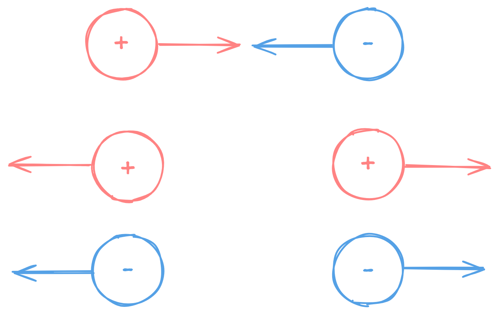
### Coulombův zákon
- vyjadřuje velikost síly `F`, kterou na sebe působí dva statické bodové elektrické náboje`Q1`, `Q2`, které jsou od sebe ve vzdálenosti `r`
	- bodový náboj je náboj, jehož geometrické rozměry jsou zanedbatelné 
- $F=\frac{1}{4\cdot\pi\cdot\varepsilon}\cdot\frac{Q_1\cdot Q_2}{r^2}$
	- $\varepsilon$ je permitivita prostředí
	- $Q_1$ a $Q_2$ jsou elektrické náboje
	- $r$ je vzdálenost mezi náboji
#### Permitivita prostředí
- udává vlastnosti (kvalitu) izolačního materiálu - dielektrika
- $\varepsilon=\varepsilon_0*\varepsilon_r$
	- $\varepsilon_0$ je permitivita vakua
		- $\varepsilon_0=8.854*10^{-12}F/m$
	- $\varepsilon_r$ je relativní permitivita
- relativní permitivita vzduchu je stejná jako vakua: $\varepsilon_r=1$

| Materiál   | $\varepsilon_r$ |
| ---------- | --------------- |
| Vzduch     | 1               |
| Polystyren | 2.6             |
| Papír      | 3.5             |
| Porcelán   | 6.5             |
| Slída      | 7               |
| Sklo       | 7.6             |
| Křemík     | 12              |
| Voda       | 80              |

#### Příklad
- zadání 
	- Jakou silou na sebe působí dva statické bodové náboje o velikostech 3,6 μC a 2 μC, které jsou od sebe vzdáleny 10 mm? 
	- Postup
		- Použijeme vzorec $F=\frac{1}{4\cdot\pi\cdot\varepsilon_0\cdot\varepsilon_r}\cdot\frac{Q_1\cdot Q_2}{r^2}$
		- Dosadíme do vzorce hodnoty
			- $Q_1=3.6*10^{-6}$
			- $Q_2=2*10^{-6}$
			- $r=10*10^{-3}m$
			- $\varepsilon_0=8.854*10^{-12}F/m$
			- $\varepsilon_r=1$
		- Výsledek vyjde $F=648N$
### Elektrostatické pole
#### Homogenní elektrostatické pole
- V každém místě má pole stejnou velikost a směr 
- Vzniká mezi dvěma rovnoběžnými nabitými deskami 

#### Nehomogenní elektrostatické pole
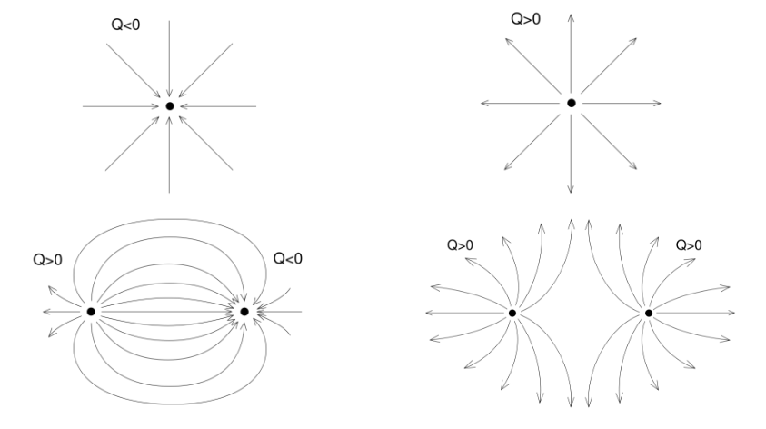
#### Intenzita elektrostatického pole
- Určuje velikost (a směr) silového působení `F` elektrostatického pole na elektrický náboj `q` v určitém místě pole. 
- Intenzita je vektorová veličina, směr je dán tečnou k siločáře.
- $E=\frac{F}{q}$
	- $F$ je silové působení elektrostatického pole
	- $q$ je elektrický náboj
- $V/m=\frac{N}{C}$
	- Zápis v jednotkách
	- $N$ - Newton
	- $C$ - Coulomb
#### Intenzita elektrostatického pole v okolí osamoceného náboje
- $E=\frac{1}{4\cdot\pi\cdot\varepsilon}\cdot\frac{Q}{r^2}$
- 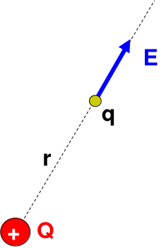
#### Příklad
- zadání
	- Vypočtěte intenzitu elektrostatického pole vytvořeného nábojem o velikosti 40 μC ve vzdálenostech: 20 mm, 40 mm, 1 m od náboje. Prostředím je vzduch.
	- Postup
		- Použijeme vzorec $E=\frac{1}{4\cdot\pi\cdot\varepsilon}\cdot\frac{Q}{r^2}$
		- Dosadíme hodnoty
			- $Q=40*10^{-6}C$
			- $\varepsilon_r=1$
			- $r_1=20*10^{-3}$
			- $r_2=40*10^{-3}$
			- $r_3=1$
		- výsledky
			- $E_{r_1}=8.99*10^8V/m$
			- $E_{r_2}=2.25*10^8V/m$
			- $E_{r_3}=3.60*10^5V/m$
#### Intenzita elektrostatického pole vytvořeného více náboji
- Výsledná intenzita je dána vektorovým součtem intenzit od jednotlivých nábojů.
- Počítáme jednotlivě pro každý náboj jeho intenzitu a následně podle vzájemného pohybu tyto náboje buď sčítáme (náboje jdou stejným směrem), odčítáme (náboje jdou opačným směrem) a nebo děláme vektorový součin (náboje jdou jinak než bylo řečeno)
- $E=E_1+E_2$
	- 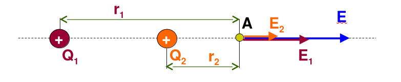
- $E=E_1-E_2$
	- 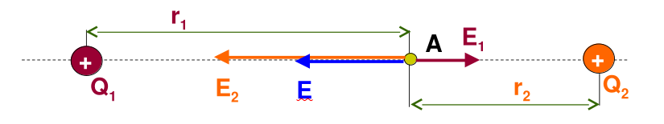
- $\overrightarrow{E}=\overrightarrow{E_1}+\overrightarrow{E_2}$
	- 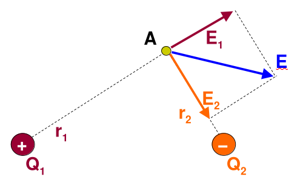
### Polarizace dielektrika
- Vložením izolantu do elektrického pole nastává jev - polarizace dielektrika.
- Při polarizaci dojde působením přitažlivé a odpudivé elektrické síly k nesymetrickému rozložení částic s elektrickým nábojem uvnitř atomů nebo molekul. 
- Z atomů nebo molekul dielektrika se stanou elektrické dipóly.
- 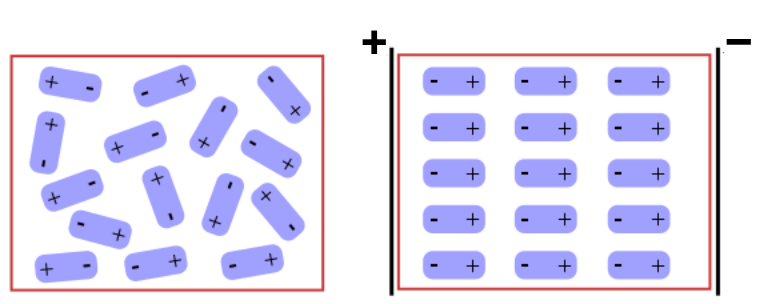
#### Elektrická pevnost dielektrika
- Působením intenzity elektrostatického pole dochází k namáhání dielektrika 
- Velikost intenzity homogenního elektrostatického pole je dána také vztahem:
	- $E=\frac{U}{d}$
		- $U$ je napětí
		- $d$ je šířka dielektrika
	- $V/m=\frac{V}{m}$
		- zapsáno jednotky
		- $V$ jsou volty
		- $m$ jsou metry
- 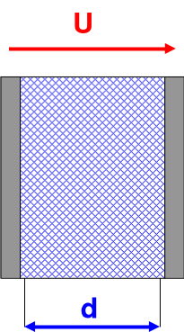
- Jestliže bude intenzita elektrického pole $E$ větší než je elektrická pevnost materiálu $E_P$ dojde k **průrazu dielektrika**. 
	- $E\ge E_{P}$
- Uvnitř dielektrika se vytvoří vodivé spojení, kterým může procházet elektrický proud.
- Po dráze elektrického proudu se díky velké elektrické síle vytrhují elektrony z atomů nebo molekul.
- Může dojít k trvalému nebo k dočasnému poškození dielektrika. 
- Možnost průrazu též charakterizuje **průrazné napětí**: udává nejmenší velikost napětí, které způsobí průraz při dané tloušťce dielektrika.
- Hodnoty dielektrické pevnosti $E_P$ pro některá dielektrika: 

| Materiál   | $E_P (MV/m)$ |
| ---------- | ------------ |
| Vzduch     | 3            |
| Sklo       | 14           |
| Papír      | 30           |
| Polystyren | 50           |
##### Příklad
- zadání
	- Vypočtěte jak minimálně silná musí být izolace vodiče, aby vydržela napětí 80 kV. Elektrická pevnost materiálu je 25 MV/m.
	- Postup
		- Pro výpočet tloušťky izolace použijeme vzorec $d=\frac{U}{E}$
		- Dosadíme hodnoty
			- $U=80*10^3$
			- $E=25*10^6$
		- Výsledek vyjde $d=3.2mm$
#### Piezoelektrický jev
- Je schopnost krystalu generovat elektrické napětí při jeho deformování, popřípadě jev opačný, kdy se krystal v elektrickém napětí deformuje. 
- Nejznámější piezoelektrickou látkou je monokrystalický křemen, křišťál. 
- Využití (přímý piezoelektrický jev): 
	- zapalovače 
	- v gramofonové přenosky
	- piezoelektrické mikrofony 
##### Využití obráceného piezoelektrického jevu
- Krystal 
	- Pasivní elektrotechnická součástka používaná v elektronických obvodech jako rezonátor s velmi přesnou a stabilní rezonanční frekvencí. 
	- Použití 
		- frekvenční filtr v rádiových přijímačích 
		- v přesných oscilátorech například ve vysílačích, v elektronických hodinách a hodinkách, pro taktování procesorů v počítačích a dalších zařízeních spotřební elektroniky
- Inkoustové tiskárny 
	- Kmity krystalu slouží k vystříknutí kapičky inkoustu. 
	- Může být použit i inkoust, kterému by vadilo zahřívání 
- Piezoměniče 
	- jsou druhy reproduktorů 
	- především malé a jednoduché 
	- sirény, bzučáky 
	- využití PC, elektronika....
## Kapacita a kondenzátory
### Kondenzátor
- Kondenzátor (kapacitor) je součástka, která je schopná hromadit elektrický náboj.
- 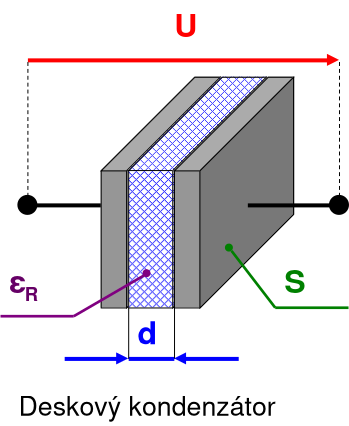
- Schématická značka: `-┤├-`
### Kapacita
- Charakteristickou veličinou kondenzátoru je kapacita `C`. 
- Udává jak velký náboj `Q` lze v kondenzátoru uchovat při napětí `U`.
- Jednotkou kapacity je Farad. 
	- $1F$ je poměrně velká jednotka, proto se v praxi často považuje za základní jednotku $1pF$.
#### Kapacita deskového kondenzátoru
- $Q=C\cdot U$
	- $Q$ velikost náboje co kondenzátor dokáže uchovat při napětí $U$
	- $C$ je kapacita kondenzátoru
	- $U$ je napětí
- $C=F\cdot V$
	- Zapsáno v jednotkách
	- $C$ je Coloumb
	- $F$ je Farad
	- $V$ jsou Volty
- $C=\varepsilon_0 \cdot \varepsilon_R \cdot \frac{S}{d}$
	- Vzorec pro výpočet kapacity kondenzátoru
	- $\varepsilon_0$ je permitivita vakua
	- $\varepsilon_R$ je relativní permitivita
	- $S$ je plocha elektrody kondenzátoru 
	- $d$ je tloušťka dielektrika
### Energie elektrostatického pole
- Práce vykonaná zdrojem elektrické energie zůstává nahromaděna v dielektriku ve formě energie elektrostatického pole.
- $W=\frac{1}{2}\cdot C \cdot U^2$
	- $C$ je kapacita kondenzátoru
	- $U$ je napětí
- $J=\frac{1}{2}\cdot F\cdot V^2$
	- Zapsáno v jednotkách
	- $J$ je Joule
	- $F$ je Farad
	- $V$ jsou Volty
### Kondenzátory
- Základní konstrukce kondenzátoru jsou dvě vodivé elektrody oddělené dielektrikem. 
- Existují různé druhy: 
	- svitkový – papírový 
	- keramický 
	- tantalový
	- elektrolytický 
	- vzduchový proměnný (otočný) 
#### Typy kondenzátorů
##### Svitkový
- Dielektrikum tvoří kondenzátorový papír ($\varepsilon_r = 4-10$) 
- Elektrody jsou tvořeny hliníkovou folií s vývody 
- Kondenzátorový papír včetně elektrod je svinut. 
- Někdy je hliník nahrazen pokovením fólie z obou stran - metalizovaný kondenzátor. 
##### Keramický
- Dielektrikem je speciální keramika s velkou permitivitou a malým ztrátovým činitelem. 
- Většinou se vyrábí sintrováním (spékáním) keramického prachu při 1100 až 1900 °C do požadovaného tvaru. 
- Vyrábí se jak pro vývodovou montáž, tak i pro povrchovou montáž SMD.. 
##### Elektrolytický
- Katoda je tvořena vodivým elektrolytem, který může být jak tekutý, polosuchý nebo pevný. 
- Anoda je tvořena čistou Al fólií na které je vrstvička $Al_2O_3$ tato vrstvička je dielektrikum. 
- Výhodou je vysoká měrná kapacita, nevýhodou naopak to, že nesmí být přepólován a obvykle snese oproti jiným typům jen velmi nízké napětí
##### Tantalový
- Tantal je materiál schopný vytvořit odolnou povrchovou vrstvu oxidu. 
- Tantalová fólie tvoří první desku kondenzátoru,oxid jako jeho dielektrikum a elektrolyt tvoří druhou desku. 
- Oxidická vrstva může být velmi tenká (tenčí než v jiných typech kondenzátorů) - v malém objemu lze získat velkou kapacitu. 
##### Vzduchový proměnný
- Má dvě hlavní součásti: rotor a stator 
- Na rotoru i statoru jsou umístěny desky které se otáčením zasouvají a vysouvají do sebe. 
- Tím se mění aktivní plocha desek a současně i kapacita. 
- Jako dielektrikum je použit vzduch (mohou být použity i polystyren, olej nebo jiné látky. 
#### Označení kondenzátorů
- Každá součástka – kondenzátor je charakterizována několika parametry: 
	- kapacita kondenzátoru 
	- výrobní tolerance 
	- maximální provozní napětí 
	- typ, provedení....
- Způsob označování se liší podle typu kondenzátoru, provedení a velikosti jeho pouzdra, i dle výrobce. 
- V dalším textu budou popsány nejběžnější způsoby označování.
- Přímým napsáním kapacity a napětí: 
	- 10μF/50V, 250nF,... 
	- používá se především u elektrolytických kondenzátorů. 
- Zapsáním předpony na místě desetinné čárky: 
	- 1n5, 68n, 470 
	- jako základní jednotka se bere 1 pF, proto se označení „p“ často vynechává, nebo se používá písmen k (kilo),M (mega): 1k5 = 1500 pF = 1,5nF 
- Zapsáním kapacity pomocí tří číslic: 
	- první a druhá číslice - hodnoty 
	- třetí číslice – násobek 
	- 473 = 47 x103 pF 
- Pomocí barevného kódu: 
	- k zjištění kapacity je nutné mít tabulku od výrobce 
- Podrobné informace o kondenzátoru lze zjistit v katalogu součástek jednotlivých výrobců 
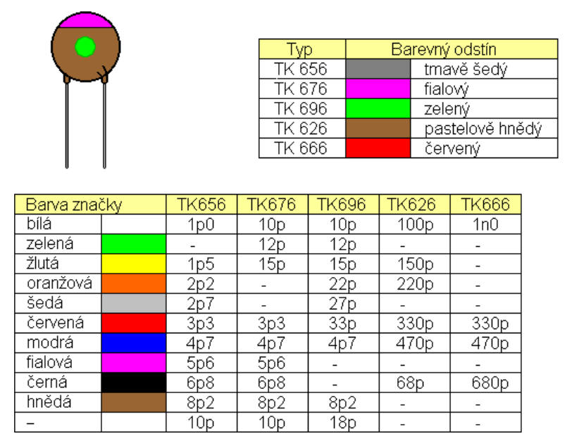
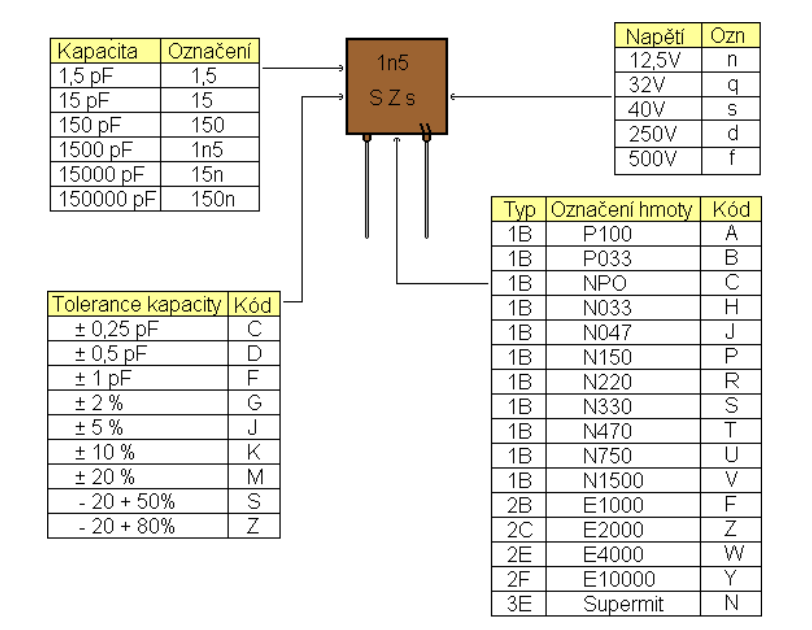
### Spojování kondenzátorů
- Kondenzátory je možné spojovat:
	- sériově
	- paralelně
		- sério-paralelně 
- Jakýkoliv obvod s kondenzátory lze nahradit jedním „výsledným“ kondenzátorem. 
#### Sériové zapojení kondenzátorů

- Vzorce
	- Napětí
		- $U=\frac{Q}{C}$
			- Celkové napětí co prochází celým obvodem na obrázku
			- $U$ je celkové napětí (na celém sériovém řetězci)
			- $Q$ je (společný) elektrický náboj na každém kondenzátoru (v sérii je stejný pro všechny kondenzátory)
			- $C$ je celková kapacita
		- $U_x=\frac{Q_x}{C_x}$
			- Napětí co prochází/vychází kondenzátorem `x` (např. kondenzátor `1`)
		- $U=U_1+U_2+U_3+...$
			- Celkové napětí je sečtení všech napětí na kondenzátorech
			- Napětí co prochází/vychází z kondenzátoru vypočítáme pomocí $U_x=\frac{Q_x}{C_x}$
	- Elektrický náboj
		- $Q=Q_1=Q_2=Q_3=...$
			- je to společná hodnota náboje na každém kondenzátoru (na jedné elektrodě jednoho kondenzátoru je $+Q$ a na sousední elektrodě $−Q$ atd.).
	- Kapacita
		- $C=\frac{1}{\frac{1}{C_1}+\frac{1}{C_2}+\frac{1}{C_3}+...}$
			- Celkovou kapacitu získáme dosazením součtu převrácených hodnot kapacity jednotlivých kondenzátorů do jedné velké převrácené hodnoty
			- Tento vzoreček vychází z tohoto vzorce $\frac{1}{C}=\frac{1}{C_1}+\frac{1}{C_2}+\frac{1}{C_3}+...$ 
				- úplně původní podobu má takovouto $\frac{Q}{C}=\frac{Q_1}{C_1}+\frac{Q_2}{C_2}+\frac{Q_3}{C_3}+...$ ale jelikož $Q=Q_1=Q_2=Q_3=...$ můžeme ve vzorci všechna $Q$ vykrátit
##### Příklad
- Máme obvod o 2 kondenzátorech zapojených sériově. Kapacity jednotlivých kondenzátorů jsou $C_1=40nF$ a $C_2=120nF$. Napětí celého obvodu je $U=20V$. Vypočítejte celkovou kapacitu obvodu $C$ dále elektrické náboje $Q;Q_1;Q_2$ a napětí na jednotlivých kondenzátorech $U_1$ a $U_2$ 
  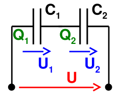
- Postup
	- Nejdříve vypočítáme celkovou kapacitu obvodu
		- To provedeme pomocí $C=\frac{1}{\frac{1}{C_1}+\frac{1}{C_2}+\frac{1}{C_3}+...}$
		- Dosadíme hodnoty
			- $C=\frac{1}{\frac{1}{40}+\frac{1}{120}}$
				- Můžeme dosadit $nF$ a nepřepočítávat to do $F$, musíme se ale ujistit že všechny jednotky jsou převedené na stejnou jednotku a že výsledná hodnota vyjde v jednotkách, ve kterých tam hodnoty vkládáme. Tudíž když zde nechceme převádět, ujistíme se že všechny jednotky jsou v $nF$ a výsledek bude také v $nF$
			- $C=30nF$
	- Nyní vypočítáme elektrický náboj obvodu
		- To provedeme pomocí vzorce $Q=C\cdot U$
		- $Q=30\cdot 10^{-9}\cdot 20$
			- Zde již potřebujeme převést jednu z hodnot, aby obě hodnoty se počítali ve stejných jednotkách, nejjednodušší je převést $nF$ na $F$ samozřejmě také můžeme $V$ převést na $nV$
		- $Q=6\cdot 10^{-7}C=0.6mC=600nC$
	- Nyní můžeme vypočítat napětí na jednotlivých kondenzátorech
		- To provedeme pomocí $U_x=\frac{Q_x}{C_x}$
		- Pro kondenzátor 1
			- $U_1=\frac{Q_1}{C_1}=\frac{600 \cdot 10^{-9}}{40 \cdot 10^{-9}}$
			- Můžeme zkrátit $10^{-9}$
			- $U_1=\frac{600}{40}=15V$
		- Pro kondenzátor 2
			- $U_2=\frac{Q_2}{C_2}=\frac{600 \cdot 10^{-9}}{120 \cdot 10^{-9}}$
			- Můžeme zkrátit $10^{-9}$
			- $U_2=\frac{600}{120}=5V$
		- Pro ověření, když sečteme výsledky měli by nám dát celkový napětí obvodu
			- $U=U_1+U_2$
			- $20V=15V+5V$
			- $20V=20V$
#### Paralelní zapojení kondenzátorů
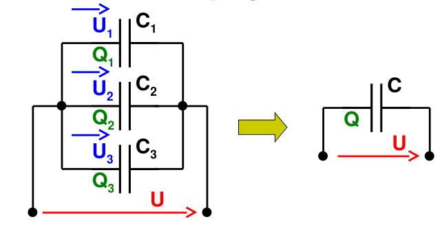
- Vzorce
	- Elektrický náboj
		- $Q=C\cdot U$
			- Vzorec pro **elektrický náboj** uložený na kondenzátoru nebo ekvivalentní soustavě.
			- $Q$ je celkový elektrický náboj (u paralelního zapojení je to součet nábojů na jednotlivých větvích)
			- $C$ je celková kapacita
			- $U$ je napětí přiložené na paralelní spoj (stejné pro všechny větve)
		- $Q_x=C_x\cdot U_x$
			- Pro výpočet elektrického náboje, uloženého v kondenzátoru `x`
		- $Q=Q_1+Q_2+Q_3+...$
			- Celkový náboj je součtem nábojů na všech paralelně zapojených kondenzátorech.
	- Napětí
		- $U=U_1=U_2=U_3=...$
			- - - Napětí je pro všechny paralelní větve stejné (je to napětí zdroje)
	- Kapacita
		- $C=C_1+C_2+C_3+...$
			- Celková kapacita se získá prostým součtem kapacit paralelně zapojených kondenzátorů.
##### Příklad
- Máme obvod o 2 kondenzátorech zapojených paralelně. Kapacity jednotlivých kondenzátorů jsou $C_1=50\mu F$ a $C_2=200\mu F$. Napětí celého obvodu je $U=10V$. Vypočítejte celkovou kapacitu obvodu $C$ dále elektrické náboje $Q;Q_1;Q_2$ a napětí na jednotlivých kondenzátorech $U_1$ a $U_2$ 
  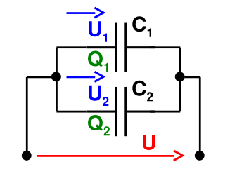
- Postup
	- Nejdříve vypočítáme celkovou kapacitu obvodu
		- použijeme $C=C_1+C_2+C_3+...$
		- $C=C_1+C_2=50\mu F + 200\mu F=250\mu F$
	- Napětí je všude stejné
		- $U=10V$
		- $U_1=10V$
		- $U_2=10V$
	- Nyní můžeme vypočítat elektrické náboje
		- Celkový el. náboj
			- $Q=C\cdot U=250\cdot 10^{-6}*10=2500\mu C$
		- Náboj u kondenzátoru 1
			- $Q_1=C_1\cdot U_1=50\cdot 10^{-6}*10=500\mu C$
		- Náboj u kondenzátoru 2
			- $Q_2=C_2\cdot U_2=200\cdot 10^{-6}*10=2000\mu C$
#### Sériové+paralelní zapojení kondenzátorů
- Při počítání kombinovaných obvodů se jednotlivé části (sériové či paralelní spojení kondenzátorů) obvodu postupně nahrazují jedním kondenzátorem. 
- „Zpětným“ postupem lze v obvodu vypočítat napětí na jednotlivých kondenzátorech, a náboje v nich. 
- ![[Kombinovane_zapojeny_kondenzatory.png]]
##### Příklad
- Máme kondenzátory $C_1=20pF;C_2=120pF;C_3=40pF;C_4=50pF;C_5=20pF;C_6=400pF$ a obvodem jde celkové napětí $U=100V$. Zjistěte celkovou kapacitu obvodu $C$ a jeho celkový elektrický náboj $Q$. Následně zjistěte napětí $U_{1-6}$ a elektický náboj $Q_{1-6}$ na každém kondenzátoru
- 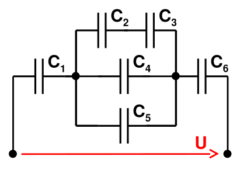
- Postup
	- Nejdříve musíme dopočítat celkové hodnoty abychom se dokázali dozvědět hodnoty na jednotlivých kondenzátorech. To provedeme díky pravidlu že zapojení sériové a paralelní dokážeme zjednodušit na 1 samotný konektor. Musíme avšak obvod postupně převádět, abychom toto pravidlo mohli použít. Nejdříve začneme sjednocení kondenzátorů $C_2$ a $C_3$ a získáme spojený kondenzátor $C_{23}$
		- Použijeme vzorec pro sériově zapojené kondenzátory
		- $C=\frac{1}{\frac{1}{C_1}+\frac{1}{C_2}+\frac{1}{C_3}+...}$
		- $C_{23}=\frac{1}{\frac{1}{C_2}+\frac{1}{C_3}}=\frac{1}{\frac{1}{120}+\frac{1}{40}}=30pF$
		- Pro výpočet napětí a elektrického náboje zatím nemáme dostatek informací
	- 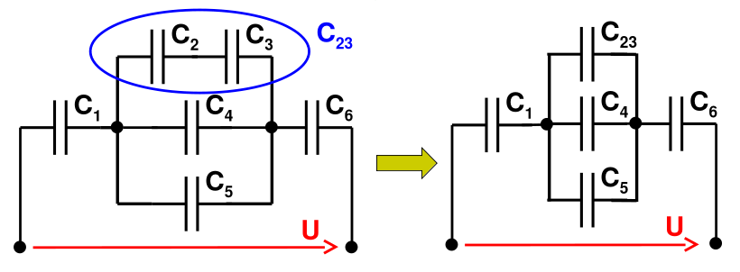
	- Nyní když máme spojené kondenzátory $C_2$ a $C_3$ můžeme spojit nově vytvořený paralelní obvod tvořený kondenzátory $C_{23}$ $C_4$ a $C_5$ opět do jednoho kondenzátoru
		- Použijeme vzorec pro paralelně zapojené kondenzátory
		- $C=C_1+C_2+C_3+...$
		- $C_{2345}=C_23+C_4+C_5=30+50+20=100pF$
		- Pro zjednodušení tento nový kondenzátor nazveme $C_A$ namísto $C_{2345}$ (jedná se pouze o grafickou úpravu)
		- Pro výpočet dalších hodnot stále nemáme dostatečné informace
	- Po spojení nám vznikne kondenzátor $C_A$ zapojený v sérii s $C_1$ a $C_6$ tyto kondenzátory nyní spojíme do jednoho
		- Znovu použijeme vzorec pro sériově zapojené kondenzátory
		- $C=\frac{1}{\frac{1}{C_1}+\frac{1}{C_2}+\frac{1}{C_3}+...}$
		- $C=\frac{1}{\frac{1}{C_1}+\frac{1}{C_A}+\frac{1}{C_6}}=\frac{1}{\frac{1}{20}+\frac{1}{100}+\frac{1}{400}}=16pF$
		- Celková kapacita obvodu je tedy $C=16pF$
		- Nyní dopočítáme celkový elektrický náboj pomocí vzorce $Q=C\cdot U$
		- $Q=16\cdot 10^{-12}\cdot 100=1600pC$ nebo $1.6nC$
	- 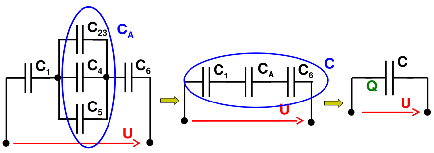
	- Nyní jakmile máme dopočítaný celkový elektrický náboj, můžeme postupně dopočítávat hodnoty na jednotlivých rezistorech. Budeme se postupně vracet zpět a obvod zase rozkládat na jednotlivé kondenzátory. Nyní můžeme dopočítat napětí a elektrický náboj na kondenzátorech $C_1$ $C_A$ a $C_6$
		- Použijeme vzorce pro sériové zapojení kondenzátorů
		- Elektrický náboj
			- pro všechny kondenzátory stejný, vzorec $Q=Q_1=Q_2=Q_3=...$
			- $Q_1=1600pC$
			- $Q_A=1600pC$
			- $Q_6=1600pC$
		- Napětí na kondenzátoru
			- vypočítáme pomocí vzorce $U_x=\frac{Q_x}{C_x}$
			- $U_1=\frac{Q_1}{C_1}=\frac{1600}{20}=80V$
			- $U_A=\frac{Q_A}{C_A}=\frac{1600}{100}=16V$
			- $U_6=\frac{Q_6}{C_6}=\frac{1600}{400}=4V$
	- 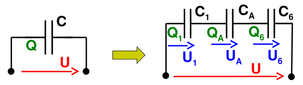
	- Nyní jakmile toto máme hotové můžeme hodnoty co jsme dopočítali pro kondenzátor $C_A$ použít pro jednotlivé kondenzátory v obvodu $C_A$
		- Použijeme vzorce pro paralelní zapojení
		- Napětí na kondenzátoru
			- všude stejné, $U=U_1=U_2=U_3=...$
			- zde ale nepoužíváme celkové napětí ale napětí co nám přichází na začátek tohoto paralelního zapojení tedy hodnota $U_A$ 
			- $U_{23}=U_A=16V$
			- $U_4=U_A=16V$
			- $U_5=U_A=16V$
		- Elektrický náboj
			- Pro výpočet elektrického náboje použijeme vzorec  $Q_x=C_x\cdot U_x$
			- $Q_{23}=C_{23}\cdot U_{23}=30\cdot 10^{-12}\cdot 16=480pC$
			- $Q_4=C_4\cdot U_4=50\cdot 10^{-12}\cdot 16=800pC$
			- $Q_5=C_5\cdot U_5=20\cdot 10^{-12}\cdot 16=320pC$
		- 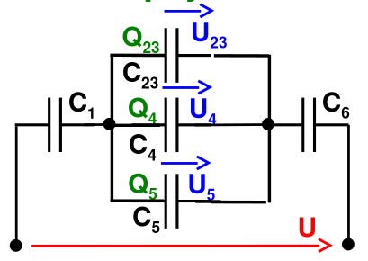
		- Nyní nám pouze zbývají kondenzátory $C_2$ a $C_3$ ty dopočítáme stejnou metodou
			- Použijeme vzorce pro sériové zapojení
			- Elektrický náboj
				- všude stejný, $Q=Q_1=Q_2=Q_3=...$
				- zde ale nepoužíváme celkový náboj ale náboj co máme specifikovaný na obvod, tedy hodnota $Q_{23}$
				- $Q_2=Q_{23}=480pC$
				- $Q_3=Q_{23}=480pC$
			- Napětí na kondenzátoru
				- Použijeme vzorec $U_x=\frac{Q_x}{C_x}$
				- $U_2=\frac{Q_2}{C_2}=\frac{480}{120}=4V$
				- $U_3=\frac{Q_3}{C_3}=\frac{480}{40}=12V$
		- 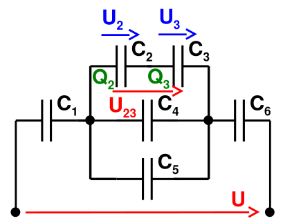
		- Nyní máme dopočítané veškeré požadované hodnoty.