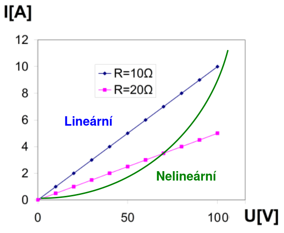
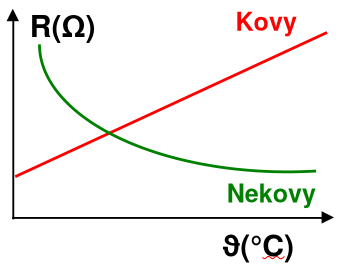
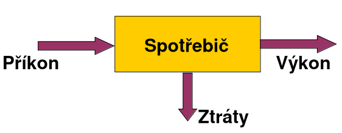
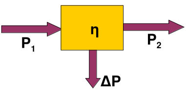
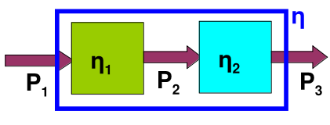
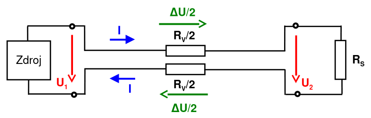
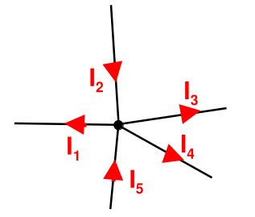
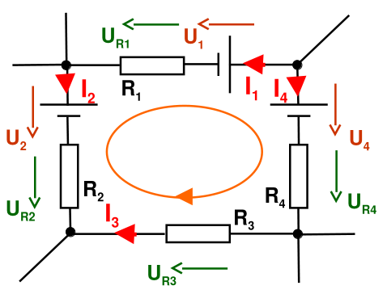
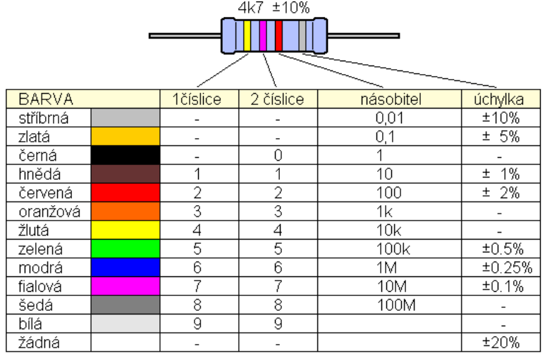

# Stejnosměrný proud
## Elektrický proud
- je fyzikální veličina, která vyjadřuje množství náboje prošlého za jednotku času.
- je tvořen uspořádaným pohybem elektrických nábojů.
- $I=\frac{Q}{t}$
	- $I$ je proud
	- $Q$ je elektrický náboj
	- $t$ je čas
- $A=\frac{C}{s}$
	- Zapsáno v jednotkách
	- $A$ je ampér
	- $C$ je coulomb
	- $s$ je sekunda
## Elektrický obvod
- Elektrický proud může procházet pouze uzavřeným elektrickým obvodem.
- V obvodu musí být zařazen zdroj elektrického napětí.
- Směr proudu je od kladného pólu k zápornému.
- Směr byl dohodnut, ve skutečnosti jsou elektrony se záporným nábojem přitahovány ke kladnému pólu.
## Proudová hustota
- Proudová hustota $J$ je poměr proudu $I$ a průřezu vodiče $S$.
	- $J=\frac{I}{S}$
		- $J$ je proudová hustota (jednotka $A/m^2$)
		- $I$ je proud (jednotka $A$ - Ampér)
		- S je průřez vodičem - plocha průřezu (jednotka $m^2$ - metr krychlový)
- Udává velikost zatížení vodiče.
- Čím vyšší hustota, tím se vodič více zahřívá.
## Ohmův zákon
- Udává závislost napětí $U$ na proudu $I$ a odporu vodiče $R$
- $U=R\cdot I$
  $I=\frac{U}{R}$
  $R=\frac{U}{I}$
	- $U$ je napětí (jednotka $V$ - Volty)
	- $R$ je odpor (jednotka Ω - Ohmy)
	- $I$ je proud (jednotka A - Ampéry)
## Voltampérová charakteristika
- je grafické znázornění závislosti proudu na napětí.
- $I=f(U)$
- 
## Elektrický odpor a vodivost
### Vodivost vodiče
- Elektrický odpor $R$ je schopnost *(neschopnost)* vodiče vést elektrický proud.
- Elektrická vodivost $G$ je „opak“ odporu.
- $G=\frac{1}{R}$
	- $G$ je elektrická vodivost (jednotka $S$ - Siemens)
	- $R$ je elektrický odpor (jednotka $Ω$ - Ohm)
- Ohmův zákon
	- $I=U\cdot G$
	- $U=\frac{I}{G}$
	- $G=\frac{I}{U}$
- Ideální vodivost vodiče odpovídá nulovému elektrickému odporu, což je vlastnost nazývaná supervodivost. V praxi takový dokonalý vodič neexistuje, ale za nejlepší reálné vodiče s nejnižší vodivostí (neboli nejvyšším měrným odporem) jsou považovány stříbro, těsně následované mědí a zlatem. Reálné vodiče mají vždy určitý, byť malý, elektrický odpor, který se navíc mění s teplotou.
### Odpor vodiče
- Odpor vodiče závisí:
	- na délce vodiče $l$
	- na průřezu vodiče $S$
	- na materiálu - rezistivitě $ρ$
- Rezistivita – měrný odpor:
	- je vlastnost vodiče závislá na použitém materiálu (a také na teplotě).
- $R=ρ\cdot \frac{l}{S}$
	- $R$ je odpor vodiče (jednotka $Ω$ - Ohmy)
	- $ρ$ je rezistivita materiálů (jednotka $Ωm$ - Ohmy na metr)
	- $l$ je délka vodiče (jednotka $m$ - metry)
	- $S$ je plocha průřezu vodiče (jednotka $m^2$ - metry čtvereční)
- $1Ωm=10^6Ωmm^2/m$
### Rezistivita vybraných vodičů
- Platí pro teplotu 20°C

| Materiál   | $ρ(Ωmm^2/m)$ |
| ---------- | ------------ |
| Stříbro    | 0.0163       |
| Měď        | 0.0178       |
| Zlato      | 0.0230       |
| Hliník     | 0,0280       |
| Wolfram    | 0,0550       |
| Zinek      | 0,0590       |
| Nikl       | 0,0700       |
| Kobalt     | 0,1100       |
| Cín        | 0,1200       |
| Železo     | 0,1300       |
| Chrom      | 0,9000       |
| Rtuť       | 0,9580       |
| Manganin   | 0,4300       |
| Nikelin    | 0,4300       |
| Konstantan | 0,4900       |
| Chromnikl  | 1,1000       |

### Závislost odporu na teplotě
- Změna teploty vyvolává změnu elektrického odporu
	- u kovových látek odpor se vzrůstající teplotou roste – kladný teplotní součinitel $α$
	- u nekovových (uhlík, izolanty, polovodiče…) odpor se vzrůstající teplotou klesá – záporný teplotní součinitel $α$
- $R_K=R_0\cdot[1+α(\vartheta_K-\vartheta_0)]$
	- $R_K$ je odpor při konečné teplotě
	- $R_0$ je odpor při počáteční teplotě
	- $\vartheta_K$ je konečná teplota
	- $\vartheta_0$ je počáteční teplota
	- $α$ je teplotní součinitel
- 
## Výkon, práce a teplo
- Elektrický výkon:
	- $P=U\cdot I$
	  $P=I^2\cdot R$
	  $P=\frac{U^2}{R}$
		- $P$ je elektrický výkon (jednotka $W$ - Watty)
		- $I$ je proud (jednotka $A$ - ampéry)
		- $U$ je napětí (jednotka $V$ - volty)
- Při průchodu elektrického proudu vodičem dochází k přeměně elektrické energie na práci $A$ nebo (joulovo) teplo $Q$.
	- $A=Q=P\cdot t$
		- $A$ je práce (jednotka $J$ - joule)
		- $Q$ je teplo (jednotka $J$ - joule)
		- $P$ je elektrický výkon (jednotka $W$ - watty)
		- $t$ je čas (jednotka $s$ - sekunda)
- Jednotkou práce a tepla je J „Joule“.
- Pro spotřebu elektrické energie se používá jiných jednotek: kWh, MWh.
	- $1J=1Ws$
	- $1Wh=3600J$
### Účinnost elektrického zařízení
- V elektrických strojích a spotřebičích se přeměňuje elektrická energie na jinou žádanou formu energie
- Při tom však vznikají ztráty (zpravidla ve formě tepla)

- Účinnost zařízení je vždy menší než 100%
- Elektrické stroje mají často účinnost vysokou,  například u transformátorů až 98%

- $\eta=\frac{P_2}{P_1}\cdot100\%$
	- $\eta$ je účinnost zařízení
	- $P_1$ je příkon (jednotka $W$ - watty)
	- $P_2$ je výkon (jednotka $W$ - watty)
- Celková účinnost složeného zařízení
	- 
	- $\eta=\eta_1\cdot \eta_2$
### Ztráty na vedení

- Odpor vedení:
	- $R_v=2\cdot ρ\cdot \frac{l}{S}$
		- $R_v$ je odpor vedení (jednotka Ω - Ohmy)
		- $ρ$ je rezistivita materiálu (jednotka $Ωm$ - Ohmy na metr)
		- $l$ je délka obvodu (jednotka $m$ - metry)
		- $S$ je plocha průřezu vodiče na obvodu (jednotka $m^2$ - metry čtvereční)  
- Úbytek napětí
	- $\Delta U=U_1-U_2$
	  $\Delta U=I\cdot R_v$
	  $I=\frac{U_1}{R_s+R_v}$
		- $\Delta U$ je úbytek napětí na obvodu (jednotka $V$ - volty)
		- $U_1$ je napětí na začátku obvodu / u zdroje (jednotka $V$ - volty)
		- $U_2$ je napětí na konci obvodu / u spotřebiče (jednotka $V$ - volty)
		- $I$ je proud protékající obvodem (jednotka $A$ - ampéry)
		- $R_v$ je odpor vedení (jednotka $Ω$ - ohmy)
		- $R_s$ je vnitřní odpor zdroje (nebo zdrojová impedance) (jednotka $Ω$ - ohmy)
- Ztráty na vedení
	- $\Delta P=\Delta U\cdot I=R_v\cdot I^2$
		- $\Delta P$ je ztráta výkonu na obvodu (jednotka $W$ - watty)
## Kirchhoffovy zákony
- dva základní zákony o elektrických obvodech.
- používají se při řešení elektrických obvodů.
### 1. kirchhoffův zákon

- Součet proudů do uzle vstupujících se rovná součtu proudů z uzle vystupují. 
	- $I_2+I_5=I_1+I_3+I_4$
- Součet proudů do uzle vstupujících se rovná nule. Vystupující proudy jsou záporné.
	- $I_1+I_2+I_3+I_4+I_5=0$
### 2. kirchhoffův zákon

- Součet napětí na uzavřené smyčce se rovná nule.
- $−I_1​⋅R_1​−U_1​+U_4​+I_4​⋅R_4​+I_3​⋅R_3​−I_2​⋅R_2​−U_2​=0$
	- Směr smyčky si určíme my
	- Prvky které jdou po směru zapisujeme do rovnice jako kladné
	- Prvky které jdou proti směru zapisujeme do rovnice jako záporné
## Rezistory
- Rezistor je součástka, jejíž charakteristickou vlastností je elektrický odpor.
- Používá se v elektronických zařízeních
- Velikost odporu může být konstantní, nebo proměnná
### Konstrukce rezistoru
- Rezistory se vyrábí buď navinutím odporového drátu, nebo nanesením uhlíkové vrstvičky na izolační podložku
- Základem rezistoru je vodič s požadovanou hodnotou odporu.
- Požadovanou hodnotu odporu lze  ovlivnit:
	- použitým materiálem
	- délkou vodiče
	- průřezem vodiče
	- $R=ρ\cdot\frac{l}{S}$
		- $R$ je odpor (jednotka Ω - Ohmy)
		- $ρ$ je rezistivita materiálu (jednotka $Ωm$ - Ohmy na metr)
		- $l$ je délka vodiče (jednotka $m$ - metry)
		- $S$ je plocha průřezu vodiče (jednotka $m^2$ - metry čtvereční)  
- Podle druhu je vodič proveden:
	- ve formě drátu 
	- ve formě tenké vrstvy
### Typy rezistorů
#### Drátový rezistor
- drát se navíjí kolem izolačního tělíska
- $+$ vyšší výkony
- $-$ vyšší cena
- $-$ větší indukčnost (je to cívka)
- jako materiál je vhodné použít látku s nízkým teplotním součinitelem odporu, aby odpor rezistoru nezáležel příliš na teplotě (manganin, konstantan)
#### Vrstvové rezistory
- vyrábí se:
	- nanesením elektricky vodivé vrstvy (například grafitu) na izolační tělísko - uhlíkové
	- napaření kovu na keramické tělísko - metalické
- $+$ levnější výroba
- $-$ menší výkony
#### Proměnné rezistory
- Elektrotechnická součástka, jejíž vlastností je proměnná velikost odporu.
- Používá se k přímému řízení elektronických zařízení (například audio a video technika), někdy též jako snímač polohy.
- Skládá se z odporové dráhy, po níž se ovládacím prvkem pohybuje jezdec.
- Dráha může mít různé průběhy odporu:
	- lineární
	- logaritmický
	- exponenciální
- Odporová vrstva může být:
	- uhlíková
	- drátová
	- z vodivého plastu
- Trimr (odporový) 
	- je pasivní součástka, jejíž hodnotu lze měnit
	- obvykle není přístupná uživateli zařízení, v němž je vestavěna
### Parametry rezistorů
- Elektrický odpor v ohmech
- Hodnoty běžně vyráběných rezistorů vybírají z řady vyvolených čísel E6, E12 nebo E24. 
- Například řada E12, obsahuje 12 hodnot:
	- 1,0; 1,2; 1,5; 1,8; 2,2; 2,7; 3,3; 3,9; 4,7; 5,6; 6,8; 8,2
- Tyto hodnoty se násobí mocninou desítky
- Maximální příkon ve wattech
- Tolerance hodnoty odporu udané na rezistoru v procentech
### Značení rezistorů
- Tolerance

| Tolerance | Značení |
| --------- | ------- |
| 20%       | M       |
| 10%       | K       |
| 5%        | J       |
| 2%        | G       |
| 1%        | F       |
| 0.5%      | D       |
| 0.25%     | C       |
| 0.1%      | B       |
- Textové značení rezistorů
	- Značení se provádí tak, že písmeno předpony (R/J,k,M) se píše na místě na místě desetinné čárky

| Hodnota zapsaná na rezistoru | Velikost v Ω |
| ---------------------------- | ------------ |
| 25K                          | 25KΩ         |
| K18                          | 180Ω         |
| M16                          | 0.16MΩ       |
| 4R5                          | 4.5Ω         |
| 560                          | 560Ω         |
| 2J6                          | 2.6Ω         |
| atd...                       |              |
- Barevné značení rezistorů

	- Barevný kód se vyznačuje proužky po obvodu součástky. 
	- Vždy je nutné určit, z které strany se kód čte. 
	- První proužek je zpravidla blíže k okraji tělesa součástky. 
	- Někdy to lze špatně poznat, v tom případě je možno orientovat se podle toho, že zlatý či stříbrný proužek nemůže být první.