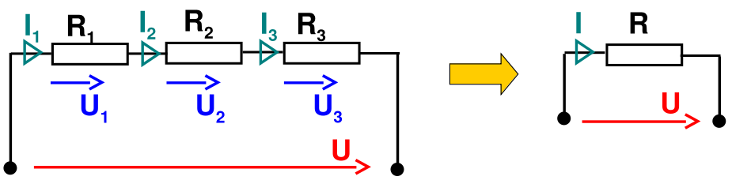
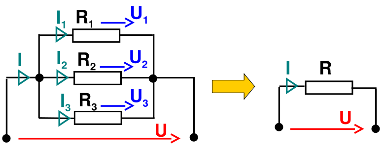
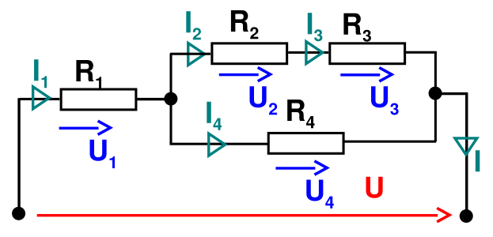
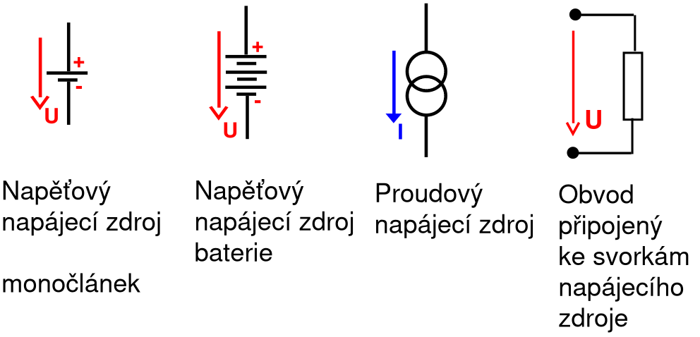
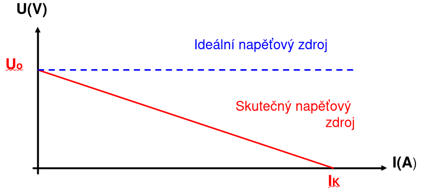
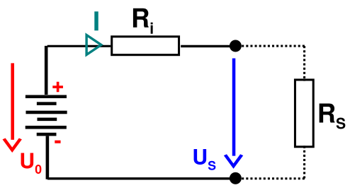
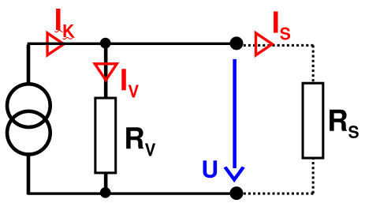
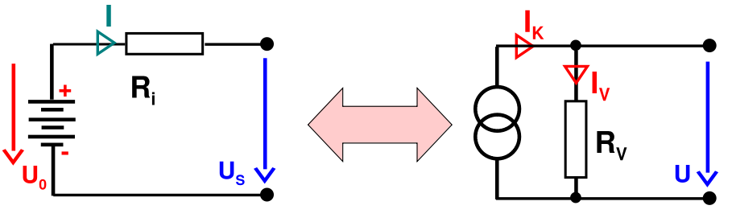
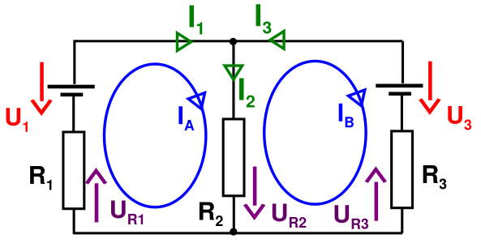
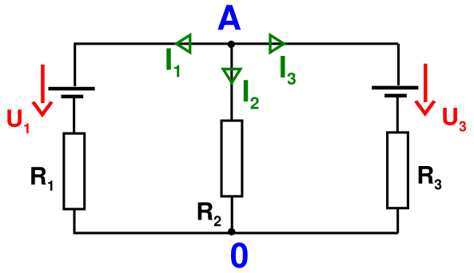

# Elektrické obvody
## Obvody s rezistory
- Rezistory je možné spojovat:
	- sériově
	- paralelně
	- sério-paralelně
- Jakýkoliv obvod s rezistory lze nahradit jedním „výsledným“ rezistorem.
### Sériové zapojení rezistorů

- Vzorce
	- Napětí
		- $U=I\cdot R$
			- $U$ je celkové napětí obvodu (jednotka $V$ - volty)
			- $I$ je celkový proud obvodu (jednotka $A$ - ampér)
			- $R$ je celkový odpor obvodu (jednotka $Ω$ - ohm)
		- $U_x=I_x\cdot R_x$
			- $U_x$ je napětí na rezistoru $x$ (jednotka $V$ - volty)
			- $I_x$ je proud na rezistoru $x$ (jednotka $A$ - ampér)
			- $R_x$ je odpor na rezistoru $x$ (jednotka $Ω$ - ohm)
		- $U=U_1+U_2+U_3+...$
			- Celkové napětí $U$ získáme sečtení napětí na všech rezistorech v sériovém zapojení
			- $U$ je celkové napětí obvodu (jednotka $V$ - volty)
			- $U_x$ je napětí na rezistoru (jednotka $V$ - volty)
	- Proud
		- $I=I_1=I_2=I_3=...$
			- $I$ je proud, proud v sériovém zapojení je všude stejný, tudíž celkový proud $I$ je stejný jako proud na každém rezistoru 
	- Odpor
		- $R=R_1+R_2+R_3+...$
			- Celkový odpor $R$ získáme sečtení odporu všech rezistorů v sériovém zapojení
			- $R$ je celkový odpor (jednotka Ω - ohmy)
			- $R_x$ je odpor rezistoru $x$ (jednotka Ω - ohmy)
- Výpočty
	- Výpočty probíhají stejně jako u kondenzátorů, postupně zjednodušujeme obvod a získáváme hodnoty z použití vzorců pro rezistory.
	- Postupy naleznete [zde](./02_Elektrostaticke_pole.md) v kapitole [[02_Elektrostaticke_pole#Sériové zapojení kondenzátorů]]
### Paralelní zapojení rezistorů

- Vzorce
	- Napětí
		- $U=U_1=U_2=U_3=...$
			- Napětí v paralelním zapojení je všude stejné, tudíž napětí na každém rezistoru je stejné jako celkové napětí $U$
			- $U$ je celkové napětí obvodu (jednotka $V$ – volty)
			- $U_x$ je napětí na rezistoru $x$ (jednotka $V$ – volty)
	- Proud
		- - $I=I_1+I_2+I_3+...$
		    - Celkový proud $I$ získáme sečtením proudů protékajících jednotlivými rezistory
		    - $I$ je celkový proud obvodu (jednotka $A$ – ampér)
		    - $I_x$ je proud protékající rezistorem $x$ (jednotka $A$ – ampér)
		- $I=\frac{U}{R}$
		    - Toto je ohmův zákon pro výpočet celkového proudu v obvodu
		    - $I$ je celkový proud obvodu (jednotka $A$ – ampér)
		    - $U$ je celkové napětí obvodu (jednotka $V$ – volty)
		    - $R$ je celkový odpor obvodu (jednotka $Ω$ – ohm)
		- $I_x=\frac{U_x}{R_x}$
		    - Ohmův zákon pro proud na jednotlivém rezistoru
		    - $I_x$ je proud na rezistoru $x$ (jednotka $A$ – ampér)
		    - $U_x$ je napětí na rezistoru $x$ (jednotka $V$ – volty)
		    - $R_x$ je odpor rezistoru $x$ (jednotka $Ω$ – ohm)
	- Odpor
		- $R=\frac{1}{\frac{1}{R_1}+\frac{1}{R_2}+\frac{1}{R_3}+...}$
			- Celkový odpor $R$ převrácením hodnoty sečtení všech převracených hodnot odporů rezistorů v sériovém zapojení
			- $R$ je celkový odpor (jednotka Ω - ohmy)
			- $R_x$ je odpor rezistoru $x$ (jednotka Ω - ohmy)
- Výpočty
	- Výpočty probíhají stejně jako u kondenzátorů, postupně zjednodušujeme obvod a získáváme hodnoty z použití vzorců pro rezistory.
	- Postupy naleznete [zde](./02_Elektrostaticke_pole.md) v kapitole [[02_Elektrostaticke_pole#Paralelní zapojení kondenzátorů]]
### Sériové+paralelní zapojení rezistorů

- Výpočty
	- Výpočty probíhají stejně jako u kondenzátorů, postupně zjednodušujeme obvod a získáváme hodnoty z použití vzorců pro rezistory.
	- Postupy naleznete [zde](./02_Elektrostaticke_pole.md) v kapitole [[02_Elektrostaticke_pole#Sériové+paralelní zapojení kondenzátorů]]
## Napájecí zdroje
### Schématické značky napájecích zdrojů

### Řazení zdrojů
- sériově
	- napětí zdrojů se sčítá
	- používá se například v bateriích, kde sériovým spojením článků lze získat vyšší napětí
- paralelně
	- napětí článků musí být stejné
	- výhodou je získání vyššího proudu 
- sério-paralelně
	- kombinuje vlastnosti sériového a paralelního spojování
### Ideální zdroje
- Napěťový
	- udržuje na svých svorkách konstantní napětí
	- má nulový vnitřní odpor
	- je schopen dodávat do obvodu libovolný proud
- Proudový
	- dodává do obvodu konstantní proud
	- má nekonečně velký vnitřní odpor
### Zatěžovací charakteristika zdroje
- Ukazuje jak poklesne výstupní napětí na svorkách zdroje při odběru proudu
- 
### Skutečný napěťový zdroj
- Skutečný napěťový zdroj lze pomyslně (pro výpočty) rozložit na dvě části:
	- ideální napěťový zdroj o napětí $U_0$. 
	- vnitřní odpor $R_i$ zapojený sériově se zdrojem. 
- 
- Stavy zdroje
	- Stav na prázdno
		- na zdroji není nic zapojené (není odebírán žádný proud)
		- $R_{S}=\infty Ω$
			- $R_S$ je odpor zátěže -> pokud není nic připojeno, chová se jako nekonečný odpor
		- $U_S=U_0$
			- napětí na prázdno
			- napětí na svorkách zdroje se rovná elektromotorickému napětí $U_0$
			- nedochází k úbytku napětí na vnitřním odporu
		- $I=0A$
			- obvodem neprochází žádný proud
	- Zatížený napěťový zdroj
		- na zdroji je zapojený obvod → je odebírán proud
		- $0Ω<R_S<\infty Ω$
			- zátěž má konečný odpor, zdroj dodává proud
		- $I=\frac{U_0}{R_i+R_S}$
			- proud je omezen jak zátěží, tak vnitřním odporem zdroje
			- čím větší $R_i$, tím menší proud zdroj dodá
	- Stav na krátko
		- svorky zdroje jsou vodivě propojeny (bez odporu)
		- $R_S=0Ω$
			- zátěžový odpor je nulový → maximální proud
		- $I_K=\frac{U_0}{R_i}$
			- Zkratovaný proud
			- je omezen pouze vnitřním odporem $R_i$
		- $U_S=0$
			- úbytek napětí je celý na vnitřním odporu → na svorkách nic nenaměříme
				- na zkratovaných svorkách nemůže být napětí
- Podle velikosti vnitřního odporu lze zdroje rozdělit na:
	- Tvrdý zdroj: 
		- při odběru proudu je pokles napětí zanedbatelný.
	- Měkký zdroj: 
		- při zatížení napětí na zdroji výrazně klesá.
	- Toto rozdělení je relativní. To co se v jednom případě považuje za tvrdý zdroj může být v jiném případě považováno za měkký zdroj
#### Příklad
- Zadání
	- Baterie má na prázdno napětí $4,5 V$. Je-li zatížena proudem $0,5A$ klesne napětí na svorkách na $4,3 V$. Jaký je její vnitřní odpor? Jaký má baterie proud na krátko?
	- Postup
		- Máme již hodnoty $U_0=4.5V;U_S=4.3V;I=0.5A$ nyní tyto hodnoty stačí dosadit do vzorečků abychom získali $U_i;R_i;I_K$
		- Pro zjištění těchto hodnot použijeme vzorce ohmova zákona
		- Napětí na rezistoru zjistíme tak že odečteme napětí po rezistoru $U_S$ od napětí před rezistorem $U_0$ tedy -> $U_i=U_0-U_S$
			- $U_i=U_0-U_S=4.5-4.3=0.2V$
		- Nyní můžeme dopočítat hodnotu odporu vnitřního rezistoru $R_i$ pomocí ohmova zákona $R=\frac{U}{I}$
			- $R_i=\frac{U_i}{I_i}=\frac{0.2}{0.5}=0.4Ω$
				- proud na rezistoru jsme získali díky vzorci $I=I_1=I_2=...$ díky zapojení v sérii
		- Nyní můžeme dopočítat velikost proudu při zkratu $I_K$ pomocí ohmova zákona $I=\frac{U}{R}$
			- $I_K=\frac{U_0}{R_i}=\frac{4.5}{0.4}=11.25A$
- Zadání
	- Elektrický zdroj napětí má napětí na prázdno 51 V a vnitřní odpor 0,5 Ω. Určete svorkové napětí při zatěžovacích odporech: $40Ω;25Ω;16.5Ω;7Ω;2.5Ω$
	- Postup
		- Napětí na zátěži vypočítáme pomocí ohmova zákona $U=I\cdot R$
			- Tím pádem potřebujeme hodnoty $U_S=I_S\cdot R_S$
				- Hodnotu $R_S$ již máme danou v zadání
				- Hodnotu $I_S$ získáme vypočítáním celkového proudu $I$
					- Díky tomu že je zátěž (rezistory) zapojená v sérii a pro toto platí vzorec $I=I_1=I_2=I_3=...$
			- Hodnotu $I_S$ tedy vypočítáme vzorcem pro výpočet $I$ tedy vzorec $I=\frac{U_0}{R_i+R_S}$
				- To dosadíme do vzorce $U_S=I_S\cdot R_S$ -> $U_S=\frac{U_0}{R_i+R_S}\cdot R_S$

| Hodnota odporu na zátěži | napětí na zátěži ($U_S=\frac{U_0}{R_i+R_S}\cdot R_S$) |
| ------------------------ | ----------------------------------------------------- |
| 40Ω                      | $U_S=\frac{51}{0.5+40}\cdot 40=50.37V$                |
| 25Ω                      | $U_S=\frac{51}{0.5+25}\cdot 25=50.00V$                |
| 16.5Ω                    | $U_S=\frac{51}{0.5+16.5}\cdot 16.5=49.50V$            |
| 7Ω                       | $U_S=\frac{51}{0.5+7}\cdot 7=47.60V$                  |
| 2.5Ω                     | $U_S=\frac{51}{0.5+2.5}\cdot 2.5=42.50V$              |

### Skutečný proudový zdroj
- Skutečný proudový zdroj lze pomyslně (pro výpočty) rozložit na dvě části:
	- ideální proudový zdroj o s proudem $I_K$
	- vnitřní odpor $R_V$ zapojený paralelně se zdrojem
- 
- Stavy zdroje
	- Stav na prázdno
		- na zdroji není nic zapojené (není odebírán žádný proud)
		- $R_{S}=\infty Ω$
			- $R_S$ je odpor zátěže -> pokud není nic připojeno, chová se jako nekonečný odpor
		- $I_K=I_V$
			- celkový proud $I_K$ prochází pouze skrz vnitřní odpor $R_V$
			- $I_V$ je proud vnitřní větvě
		- $I_S=0A$
			- zátěžový proud je nulový
		- $U=R_V\cdot I_K$
			- napětí na svorkách je dáno proudem zdroje a vnitřním odporem
	- Zatížený napěťový zdroj
		- na zdroji je zapojený obvod → je odebírán proud
		- $0Ω<R_S<\infty Ω$
			- zátěž má konečný odpor, zdroj dodává proud
		- $U=I_K\cdot(R_S||R_V)$ -> $U=I_K\cdot(\frac{1}{\frac{1}{R_S}+\frac{1}{R_V}})$
			- napětí na svorkách je dáno ohmovým zákonem 
				- paralelním spojením odporu zátěže $R_S$ a vnitřního odporu $R_V$
				- Celkového proudu $I_K$
		- $I_K=I_S+I_V$
			- část proudu jde do zátěže ($I_S$) a zbytek přes vnitřní odpor ($I_V$)
	- Stav na krátko
		- svorky zdroje jsou vodivě propojeny (bez odporu)
		- $R_S=0Ω$
			- zátěžový odpor je nulový → maximální proud
		- $I_S=I_K$
			- veškerý proud jde do zkratu
			- žádný proud neteče vnitřním odporem $R_V$ (je přeskočen)
		- $U_S=0V$
			- úbytek napětí je celý na vnitřním odporu → na svorkách nic nenaměříme
				- na zkratovaných svorkách nemůže být napětí
#### Příklad
- zadání
	- Ke skutečnému proudovému zdroji s zkratovým proudem 300 mA a vnitřním odporem 10 Ω je připojena odporová zátěž.Určete napětí na svorkách na prázdno a napětí na svorkách a proud procházející zátěží při odporech: $100Ω;40Ω;25Ω;10Ω$
	- Postup
		- Napětí na zátěži vypočítáme pomocí ohmova zákona $U=I\cdot R$ 
		- Tím pádem potřebujeme hodnoty $U=I_S\cdot R_S$  
		- Hodnotu $R_S$ již máme danou v zadání  
		- Hodnotu $I_S$ získáme tak, že nejprve spočítáme napětí na svorkách zdroje $U$ a pak použijeme $I_S=\frac{U}{R_S}$  
		- Napětí na svorkách pro proudový zdroj vypočítáme jako $U=I_K\cdot (R_S\parallel R_V)$  
		- kde $R_S\parallel R_V=\frac{1}{\frac{1}{R_S}+\frac{1}{R_V}}$  
		- Na prázdno ($R_S=\infty$) platí $U_{prázdno}=I_K\cdot R_V$ a $I_S=0$

| Hodnota odporu na zátěži | napětí na zátěži ($U=I_K\cdot (R_S\parallel R_V)$)                                                               | proud v zátěži ($I_S=\dfrac{U}{R_S}$)                                |
| ------------------------ | ---------------------------------------------------------------------------------------------------------------- | -------------------------------------------------------------------- |
| prázdno ($R_S=\infty$)   | $U_{\text{prázdno}}=0{,}3\cdot 10=3{,}00\ \text{V}$                                                              | $I_S=0\ \text{A}$                                                    |
| 100Ω                     | $R_{eq}=\dfrac{1}{\frac{1}{100}+\frac{1}{10}}=9{,}0909\ \Omega$ → $U=0{,}3\cdot9{,}0909=2{,}7273\ \text{V}$      | $I_S=\dfrac{2{,}7273}{100}=0{,}02727\ \text{A}=27{,}27\ \text{mA}$   |
| 40Ω                      | $R_{eq}=\dfrac{1}{\frac{1}{40}+\frac{1}{10}}=8{,}0\ \Omega$ → $U=0{,}3\cdot8{,}0=2{,}400\ \text{V}$              | $I_S=\dfrac{2{,}400}{40}=0{,}06\ \text{A}=60{,}00\ \text{mA}$        |
| 25Ω                      | $R_{eq}=\dfrac{1}{\frac{1}{25}+\frac{1}{10}}=7{,}142857\ \Omega$ → $U=0{,}3\cdot7{,}142857=2{,}142857\ \text{V}$ | $I_S=\dfrac{2{,}142857}{25}=0{,}085714\ \text{A}=85{,}71\ \text{mA}$ |
| 10Ω                      | $R_{eq}=\dfrac{1}{\frac{1}{10}+\frac{1}{10}}=5{,}0\ \Omega$ → $U=0{,}3\cdot5{,}0=1{,}500\ \text{V}$              | $I_S=\dfrac{1{,}500}{10}=0{,}15\ \text{A}=150{,}00\ \text{mA}$       |
### Duální zdroje
- Napěťový a proudový zdroj lze vzájemně zaměnit (může to být výhodné při výpočtech složitějších obvodů)
- 
- $R_I=R_V$
	- vnitřní odpor $R_V$ proudového zdroje je stejný jako odpor napěťového zdroje $R_i$ po transformaci
- $U_0=R_V\cdot I_K$
	- převod mezi ideálním proudovým zdrojem a jeho duálním napěťovým modelem
#### Příklad
- zadání
	- Proudový zdroj z příkladu proudového zdroje (300 mA  / 10 Ω) nahraďte ekvivalentním napěťovým zdrojem. Určete napětí na svorkách a proud procházející zátěží při odporech: $100Ω;40Ω;25Ω;10Ω$
	- Postup
		- Nejprve si vytvoříme ekvivalentní napěťový zdroj
		    - Výpočet podle vztahu mezi duálními zdroji
		        - $U_0=I_K⋅R_V$
		            - $I_K=300 mA=0.3A$          
		            - $R_V=10Ω$
		            - $U0=0.3⋅10=3V$
	        - Vnitřní odpor zůstává stejný
	            - $Ri=RV=10Ω$
		- Nyní jde o výpočet jako u skutečného napěťového zdroje
		    - Napětí na zátěži vypočítáme pomocí:
		        - $U_S= \frac{U_0}{R_i + R_S} \cdot R_S$​
		    - Proud procházející zátěží podle Ohmova zákona:
		        - $I_S=\frac{U_S}{R_S}$

| Hodnota odporu na zátěži | napětí na zátěži $U_S= \frac{U_0}{R_i + R_S} \cdot R_S$​ | proud $I_S=\frac{U_S}{R_S}$​​ |
| ------------------------ | -------------------------------------------------------- | ----------------------------- |
| 100Ω                     | $U_S=\frac{3}{10+100}\cdot 100=2.73V$                    | $I_S=\frac{2.73}{100}=0.027A$ |
| 40Ω                      | $U_S=\frac{3}{10+40}\cdot 40=2.40V$                      | $I_S=\frac{2.40}{40}=0.060A$  |
| 25Ω                      | $U_S=\frac{3}{10+25}\cdot 25=2.14V$                      | $I_S=\frac{2.14}{25}=0.086A$  |
| 10Ω                      | $U_S=\frac{3}{10+10}\cdot 10=1.50V$                      | $I_S=\frac{1.50}{10}=0.150A$  |
## Řešení elektrických obvodů
### Metody řešení elektrických obvodů
- Pro řešení složitějších elektrických obvodů se využívá různých metod.
- Tyto metody vycházejí z Kirchhoffových zákonů.
- Vyřešení obvodů často vede k řešení jedné lineární rovnice či soustavy lineárních rovnic.
#### Metoda smyčkových proudů

- Smyčkový proud je **pomyslný proud**, který obíhá v jedné uzavřené smyčce (okruhu) obvodu.
- v obvodu si zvolíme proudové smyčky 
- směr je libovolný (bude-li zvolen obráceně, vyjde proud záporný)
	- Směr proudů si můžeme zvolit libovolně (obvykle všechny ve směru hodinových ručiček). Když zvolíš opačně, nebo proud poteče opačně, výsledek prostě vyjde záporný.
- pro jednotlivé smyčky sestavíme rovnice:
	- $\Sigma_{K=1}^{N}U_{K}=0$
	- pokud má napětí zdroje směr shodný se směrem smyčky zapíšeme kladnou hodnotu pro opačný zápornou
	- napětí na rezistoru přičteme jako součin $R\cdot I$
- po vypočtení smyčkových proudů můžeme dopočítat další hodnoty obvodu
- Pokud se dvě smyčky setkávají na společném rezistoru, **teče jím rozdíl těchto dvou smyčkových proudů** (např. $I_A−I_B​$).
- Postup výpočtu
	1. **Nakreslíš obvod** a zvolíš smyčky:
	    - Levá smyčka → proud $I_A$
	    - Pravá smyčka → proud $I_B$​
	2. **Označíš polaritu napětí a směry smyček.**
	    - Napětí zdrojů, která „pomáhají“ směru smyčky → kladné
	    - Napětí zdrojů, která „brzdí“ smyčku → záporné
	    - Na odporech: $U=R⋅I$, přičemž proud může být kombinací dvou smyčkových proudů (např. $R_2 \cdot (I_A - I_B)$)
	3. **Sestavíš rovnice pro každou smyčku podle 2. Kirchhoffova zákona**:
		- Každá smyčka = 1 rovnice
	    - $∑U=0$
##### Příklad
- 
- Máme zadané hodnoty $R_1=5Ω;R_2=4Ω;R_3=5Ω;U_1=30V;U_2=35V$ pomocí metody smyčkových proudů vypočtěte proud v jednotlivých větví $I_1;I_2;I_3$, a napětí na rezistorech $U_{R_1};U_{R_2};U_{R_3}$
- Postup:
	- Sestavíme si rovnice pro obě smyčky pomocí 2. Kirchhoffova zákona
		- $I:R_1\cdot I_A-U_1+R_2\cdot(I_A-I_B)=0$
			- $R_1​⋅I_A$​ – úbytek napětí na odporu $R_1$​, kterým protéká pouze proud smyčky $I_A$
			- $-U_1$  – napětí zdroje $U_1$​ má směr **opačný** ke směru smyčkového proudu, proto se zapisuje se **záporným znaménkem**.
			- $R_2 \cdot (I_A - I_B)$ – úbytek napětí na odporu $R_2$​, který je **společný pro obě smyčky**. Tímto rezistorem protéká rozdíl proudů $(I_A - I_B)$
		  $II:R_2\cdot(I_B-I_A)+U_3+R_3\cdot I_B=0$
			- $R_2​⋅(I_B​−I_A​)$ – stejný společný odpor $R_2$​, ale tentokrát sledujeme smyčku $I_B$​, takže proudy se v rozdílu obrátí.
			- $+U_3$​ – napětí zdroje $U_3$ má směr **shodný** se směrem proudu $I_B$​, proto je **kladné**.
			- $R_3 \cdot I_B$ – úbytek napětí na odporu $R_3$​, kterým protéká proud $I_B$​.
		- Dosadíme hodnoty
		- $I:5I_A-30+4I_A-4I_B=0$
		  $II:4I_B-4I_A+35+5I_B=0$
		- Upravíme
		- $I:9I_A-4I_B-30=0$
		  $II:9I_B-4I_A+35=0$
	- Nyní pouze dopočítáváme rovnice o dvou neznámých
		- Výpočet rovnic přeskočíme
		- $I_A=2A$
		  $I_B=-3A$
			- Proud vyšel záporný -> teče opačným směrem než jsme zvolili smyčku
	- Jakmile máme výsledný pomyslný proud vypočtený, můžeme vypočítat skutečný proud na jednotlivých větví $I_1;I_2;I_3$ 
	- 
		- $I_1=I_A=2A$
			- Jelikož napětí vyšlo kladné není potřeba žádná úprava
		  $I_2=I_A-I_B=5A$
			- Na společné větvi dvou smyček teče jejich rozdíl 
		  $I_3=-I_B=3A$
			- Jelikož proud teče opačně, vynásobíme výsledek $\cdot -1$
	- Nyní jakmile máme skutečný proud na větvích, můžeme pomocí jich dopočítat napětí na rezistorech $U_{R_1};U_{R_2};U_{R_3}$
		- $U_{R_1}=R_1\cdot I_1=10V$
		  $U_{R_2}=R_2\cdot I_2=20V$
		  $U_{R_3}=R_3\cdot I_3=15V$
#### Metoda uzlových napětí

- v obvodu si zvolíme jeden „nulový“ uzel.
- k tomuto uzlu se budou vztahovat napětí ostatních uzlů v obvodu
- pro ostatní uzle sestavíme rovnice:
	- $\Sigma_{K=1}^{N}I_{K}=0$
	- proud větve získáme jako podíl součtu všech napětí a součtu všech odporů ve větvi.
	- pokud má napětí zdroje směr shodný se směrem proudu ve větvi, odečítá se od uzlového napětí, pří opačném směru se přičítá k uzlovému napětí
##### Příklad
- 
- Máme zadané hodnoty $R_1=5Ω;R_2=4Ω;R_3=5Ω;U_1=30V;U_2=35V$ pomocí metody smyčkových proudů vypočtěte proud v jednotlivých větví $I_1;I_2;I_3$, a napětí na rezistorech $U_{R_1};U_{R_2};U_{R_3}$
- Postup
	- $\frac{A-U_1}{R_1}+\frac{A}{R_2}+\frac{A-U_3}{R_3}=0$
	- $\frac{A-30}{5}+\frac{A}{4}+\frac{A-35}{5}=0$
	- $4A-120+5A+4A-140=0$
	- $13A=260$
	- $A=20V$
	- $I_1=\frac{A-U_1}{R_1}=-2A$
	- $I_2=\frac{A}{R_2}=5A$
	- $I_3=\frac{A-U_3}{R_3}=-3A$
	- Nyní jakmile máme skutečný proud na větvích, můžeme pomocí jich dopočítat napětí na rezistorech $U_{R_1};U_{R_2};U_{R_3}$
		- $U_{R_1}=R_1\cdot I_1=10V$
		  $U_{R_2}=R_2\cdot I_2=20V$
		  $U_{R_3}=R_3\cdot I_3=15V$
#### Theveninova věta
![[Theveninova_veta.png]]
- Jakýkoliv obvod, nebo část obvodu se dvěma svorkami lze nahradit skutečným napěťovým zdrojem (ideální napěťový zdroj a jeho vnitřní odpor)
- Výpočet vnitřního odporu $R_i$:
	- všechny napěťové zdroje spojíme nakrátko
	- všechny proudové zdroje v obvodu vynecháme
	- vypočteme odpor obvodu mezi svorkami
- Výpočet napětí zdroje $U_0$:
	- odpojíme zátěž $R_S$
	- spočítáme napětí mezi svorkami 
##### Příklad
- ![[Theveninova_veta_priklad_1.png]]
- $R_1=30Ω;R_2=60Ω;U=120V$
- ![[Theveninova_veta_priklad_2.png]]
- $R_i=\frac{1}{\frac{1}{R_1}+\frac{1}{R_2}}=20Ω$
- $I=\frac{U}{R_1+R_2}=1.33A$
- $U_0=I\cdot R_2=80V$
#### Nortonova věta
#### Princip superpozice
#### Dělič napětí
#### Transfigurace hvězda-trojúhelník
