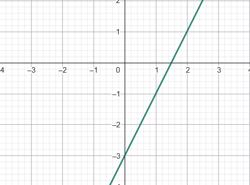
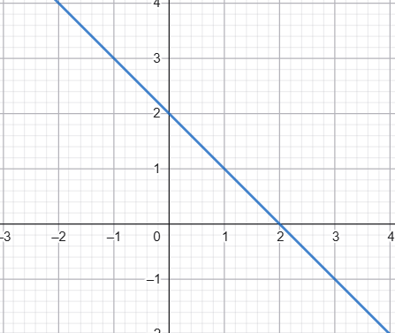
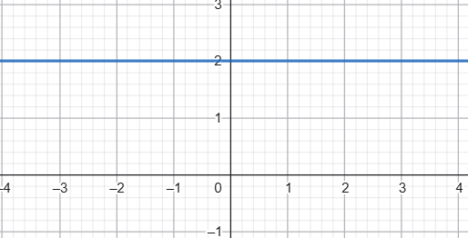

# Pětiminutovky
## Úhly
- máme úhly $\alpha=1246˚;\beta=-3375˚$ a chceme
	- Stupně mezi 0-360 ->
		- $\alpha=166˚;\beta=225˚$
	- Převést na radiány
		- $\alpha=166˚$ -> $\alpha=166˚*\frac{\pi}{180}=\frac{83}{90}\pi$
		- $\beta=225˚$ -> $\beta=225˚*\frac{\pi}{180}=\frac{5}{4}\pi$
	- Vypočítat sin, cos, tan, cotan
		- $sin\alpha=\sin\left(166˚\right)=0.2419$
		  $sin\beta=\sin\left(225˚\right)=-\frac{\sqrt2}{2}$
		- $cos\alpha=\cos\left(166˚\right)=−0,9702$
		  $cos\beta=\cos\left(225˚\right)=-\frac{\sqrt2}{2}$
		- $tan\alpha=\tan\left(166˚\right)=−0,2493$
		  $tan\beta=\tan\left(225˚\right)=1$
		- $cotan\alpha=(\tan\left(166˚\right))^{-1}=−4,01$
		  $cotan\beta=(\tan\left(225˚\right))^{-1}=1$
## Cvičný test k maturitě
- Zadání 1
	- Zjednodušte výrazy
		- $3m-\frac34m-\frac38m$
			1. Společný jmenovatel
				- $\frac{24-6-3}{8}m$
			2. zjednodušit
				- $\frac{15}{8}m$
		- $8a\cdot\frac34a$
			1. Vynásobíme
				- $\frac81a\cdot\frac34a$
				- $\frac{24}{4}a^2$
				- zkrátíme
				- $6a^2$
- Zadání 2
	- Řešte nerovnici $\frac{x+7}{3}\le2x-1$ . Výsledek zapište intervalem
		1. Zbavíme se zlomku
			- $x+7\le6x-3$
		2. Přesuneme členy na druhou stranu aby jsme si rovnici zjednodušili
			- $10\le5x$
		3. Zjednodušíme
			- $2\le x$
			- $x\ge2$
		4. Zapíšeme výsledek intervalem
			- $x\in<2;\infty)$

## Převody jednotek
- $365 mg = 0.000365kg$
- $52,6 m³ = 52 600 000 cm^3$
- $0,3cm² = 0,00000000003km²$
- $3768m=0.000000003768Tm$
- $0.032m³=32000000mm³$
- $520kg=520000g$
- $3500m²=0.0035km²$

## Zlomky
1. Upravte: $\frac{a^4-b^4}{a^2b^2}:\left(\left(1+\frac{b^2}{a^2}\right)\cdot\left(1-\frac{2a}{b}+\frac{a^2}{b^2}\right)\right)$
	1. Převeďte na spol. jmenovatele: $\frac{a^4-b^4}{a^2b^2}:\left(\left(\frac{a^2+b^2}{a^2}\right)\cdot\left(\frac{b^2-2ab+a^2}{b^2}\right)\right)$
	2. Zkrátíme $\frac{a^4-b^4}{a^2b^2}:\left(\left(\frac{a^2+b^2}{a^2}\right)\cdot\left(\frac{\left(a-b\right)^2}{b^2}\right)\right)$
	3. Vynásobíme zlomky $\frac{\left(a^2-b^2\right)\left(a^2+b^2\right)}{a^2b^2}:\frac{\left(a^2+b^2\right)\cdot\left(a-b\right)^2}{a^2b^2}$
	4. Převrátíme $\frac{\left(a^2-b^2\right)\left(a^2+b^2\right)}{a^2b^2}*\frac{a^2b^2}{\left(a^2+b^2\right)\cdot\left(a-b\right)^2}$
	5. Zkrátíme a vynásobíme $\frac{\left(a^2-b^2\right)}{\left(a-b\right)^2}$
	6. Rozložíme $\frac{\left(a-b\right)\left(a+b\right)}{\left(a-b\right)^2}$
	7. Zjednodušíme $\frac{\left(a+b\right)}{\left(a-b\right)}$
	8. Podmínka $a\ne b$
2.  Upravte: $\left(\frac{a+b}{2a-2b}-\frac{a-b}{2a+2b}+\frac{2b^2}{a^2-b^2}\right):\frac{4b}{\left(a-b\right)\cdot\left(a^2+b^2\right)}$
	1. Zkrátíme $\left(\frac{a+b}{2\left(a-b\right)}-\frac{a-b}{2\left(a+b\right)}+\frac{2b^2}{\left(a-b\right)\left(a+b\right)}\right):\frac{4b}{\left(a-b\right)\cdot\left(a^2+b^2\right)}$
	2. Převrátíme $\left(\frac{a+b}{2\left(a-b\right)}-\frac{a-b}{2\left(a+b\right)}+\frac{2b^2}{\left(a-b\right)\left(a+b\right)}\right)\cdot\frac{\left(a-b\right)\cdot\left(a^2+b^2\right)}{4b}$
	3. Společný jmenovatel $\frac{\left(a+b\right)^2-\left(a-b\right)^2+4b^2}{2\left(a-b\right)\left(a+b\right)}\cdot\frac{\left(a-b\right)\cdot\left(a^2+b^2\right)}{4b}$
	4. Roznásobíme $\frac{a^2+2ab+b^2-a^2+2ab-b^2+4b^2}{2\left(a-b\right)\left(a+b\right)}\cdot\frac{\left(a-b\right)\cdot\left(a^2+b^2\right)}{4b}$
	5. Zkrátíme $\frac{4ab+4b^2}{2\left(a-b\right)\left(a+b\right)}\cdot\frac{\left(a-b\right)\cdot\left(a^2+b^2\right)}{4b}$
	6. Vykrátíme $\frac{4b(a+b)}{2\left(a-b\right)\left(a+b\right)}\cdot\frac{\left(a-b\right)\cdot\left(a^2+b^2\right)}{4b}$
	7. Zkrátíme $\frac12\cdot\frac{\left(a^2+b^2\right)}{1}$
	8. Vynásobíme $\frac{\left(a^2+b^2\right)}{2}$

## Lineární funkce
- $f:y=2x-3$
	- přímka roste jelikož `x` je kladný (poměr 1:2 - jedna doprava, dvě nahoru)
	- na ose `y` je protnutá v `-3`
	- 
- $g:y=-x+2$
	- přímka klesá jelikož`x` je záporné (poměr 1:1)
	- osu `y` je protnutá v `2`
	- 
- $h:y=2$
	- přímka neroste ani neklesá
	- osu `y` je protnutá v `2`
	- Obor hodnot je pouze `2`
	- 
## Množiny
1. $\left\lbrace x\in N;3x<13\right\rbrace$ -> $x={1,2,3,4}$
2. $\left\lbrace x\in N;x^2<26\right\rbrace$ -> $x={1,2,3,4,5}$
3. $\left\lbrace x\in N;x^2=3\right\rbrace$ -> $x=∅$

## Mnohočleny
- jsou dány mnohočleny $P(x)=x^3+x²-x+21$ a $Q(x)=2x-3$
	- Urči jejich stupně
		- (je to největší mocnina u x)
		- $P(x)$ je třetí stupeň
		- $Q(x)$ je první stupeň
	- Urči kvadratický člen mnohočlenu $P(x)$
		- $x²$
	- Porovnej koeficienty lineárních členů mnohočlenů $P(x)$ a $Q(x)$
		- $P(x): -1$ a $Q(x):2$ 
## Měřítko na mapě
- Na mapě, měřítku 1:25 000, má pozemek délku 30mm a šířku 21mm
- Určete
	- Jaké rozměry má pozemek ve skutečnosti
		- 1cm = 25 000cm
		- 3cm = 750 m
		- 2,1cm = 525 m
	- Jaká bude šířka, pokud bude délka pozemku 50 cm
		- 75000 : 50 = 1500
		- 1 : 1500
		- x * 1500 = 52 500
		- x = 52500/1500 = 35cm
	- Jaké měřítko má nový plán
		- 1 : 1500