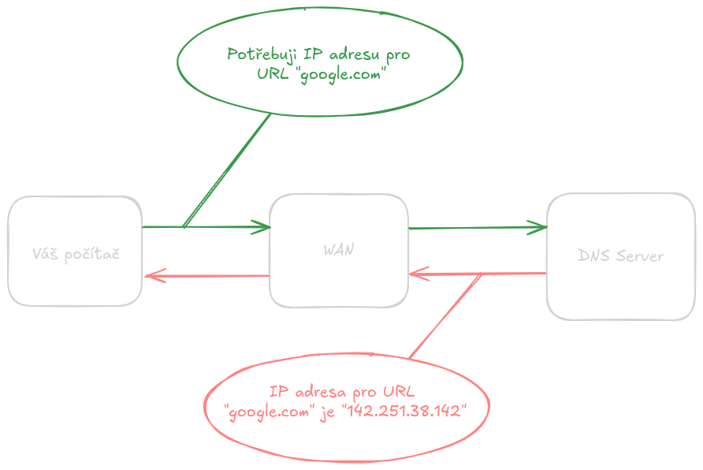
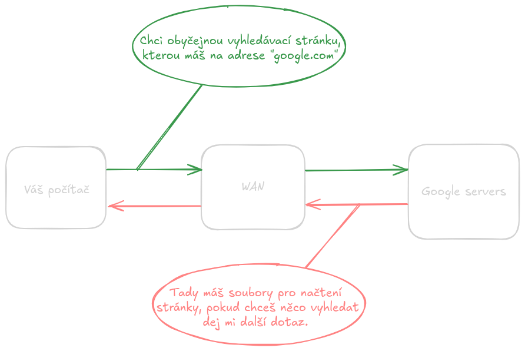

# Webové aplikace
## Jak funguje web
- Web dnes vnímáme jako samozřejmost – zadáme adresu, stránka se objeví a můžeme ji používat. Abychom však dokázali webové aplikace efektivně vytvářet a optimalizovat, je důležité pochopit, co se děje „v zákulisí“. Celý proces funguje jako spolupráce několika vrstev technologií, které společně zajistí, že se obsah uložený na vzdáleném serveru promění ve stránku, kterou vidíme v prohlížeči.
- Webový prohlížeč, server a síťová komunikace tvoří základní stavební kameny každé webové aplikace. Prohlížeč interpretuje kód, server poskytuje data a síť zajišťuje přenos informací mezi nimi. Znalost jejich role a vzájemných interakcí je klíčová pro každého vývojáře.
### Co je webová stránka a jak vzniká
- Webová stránka je dokument napsaný primárně pomocí HTML, který popisuje strukturu obsahu. Na tento základ se aplikuje CSS, které definuje vzhled, a JavaScript, který řídí interaktivitu a logiku na straně uživatele.
- Prohlížeč načte soubory HTML, CSS a JS, postupně je interpretuje a vytvoří z nich vizuální podobu stránky. Tento proces zahrnuje vytvoření tzv. Document Object Modelu (DOM), což je stromová reprezentace HTML dokumentu, a následné vykreslení výsledku na obrazovku.
- _Jednoduše řečeno: HTML říká „co tam je“, CSS říká „jak to vypadá“ a JavaScript říká „co se má stát“._
### URL, domény a DNS
- Aby uživatel mohl stránku navštívit, musí znát její adresu. K tomu slouží URL (Uniform Resource Locator), které funguje podobně jako adresa domu – přesně popisuje, kde se daný obsah nachází.
- Doména (např. **google.com**) je uživatelsky přívětivá alternativa k číselné IP adrese (Google IPv4 `142.251.38.142`) serveru. Překlad domény na IP adresu zajišťuje DNS (Domain Name System). Když uživatel zadá adresu do prohlížeče, ten se nejprve dotáže DNS serveru, který mu sdělí, kde web fyzicky leží.
- 
- **Struktura URL:** 
	- `https://` (protokol)
	- `www.google.com` (doména/host)
	- `/vyhledavani` (cesta)
	- `?q=dotaz` (query parametry) To se hodí později pro pochopení REST API a routování.
- Detailněji toto téma bude vysvětleno později.
### Hosting a nasazení
- Webová stránka musí někde fyzicky být uložená, aby ji mohli uživatelé navštívit. Hosting představuje službu, která nabízí prostor na serveru a připojení k internetu. Pro jednoduché statické stránky mohou být použity služby jako Netlify, Vercel nebo GitHub Pages.
	- Webovou stránku můžete hostovat i na obyčejném laptopu či raspberry pi!
- Komplexnější aplikace vyžadují serverový backend, databázi a někdy i více propojených služeb. Proces, kdy vývojář publikuje svou aplikaci na internet, se nazývá nasazení (deployment).
- Detailněji toto téma bude vysvětleno později.
### Client vs Server
- Webová architektura se většinou dělí na část klientskou (frontend) a serverovou (backend).
- **Klient** je uživatelův prohlížeč – zobrazuje obsah, provádí JavaScript a většinu interakcí.  
- **Server** je vzdálený počítač, který zpracovává požadavky, poskytuje data, generuje odpovědi a často komunikuje s databází.
- Frontend a backend spolu komunikují pomocí protokolů a struktur dat, nejčastěji pomocí HTTP a JSON.
- 
- Detailněji toto téma bude vysvětleno později.
### Request a Response
- Komunikace mezi klientem a serverem probíhá na principu požadavků (request) a odpovědí (response). (můžeme vidět už na obrázku výše)
	- Klient odešle request – například „chci stránku /produkty“.
	- Server request zpracuje a vrátí response – HTML dokument, JSON data nebo chybu, pokud není požadavek platný.
- Pochopení tohoto cyklu je klíčové pro jakýkoli webový vývoj, protože většina aplikací neustále komunikuje se serverem.
- Detailněji toto téma bude vysvětleno později.
### Cookies, Session, LocalStorage
- Webové aplikace často potřebují uchovávat informace o uživateli – například, zda je přihlášen. K tomu slouží různé metody:
	- **Cookies**  
		- Malé textové soubory uložené v prohlížeči, často používané pro autentizaci.
	- **Session (relace)**  
		- Informace uložené na serveru, propojené s uživatelem pomocí cookie se session ID.
	- **LocalStorage**  
		- Trvalé lokální úložiště v prohlížeči, vhodné pro ukládání uživatelských preferencí nebo stavů aplikace.
- Každý způsob má své výhody a ideální použití, které vývojář musí znát.
- Detailněji toto téma bude vysvětleno později.
---
## Nástroje vývojáře webu
- Moderní webový vývoj se neopírá pouze o znalost HTML, CSS a JavaScriptu. Stejně důležitá je i orientace v nástrojích, které vývoj umožňují, zrychlují a zpříjemňují. Tato kapitola představuje základní vybavení každého webového vývojáře – od prohlížečů a jejich ladicích funkcí až po editor kódu, verzovací systémy a strukturu projektu.
- Cílem není jen ukázat jednotlivé nástroje, ale také vysvětlit jejich roli v běžném pracovním procesu, aby čtenář rozuměl nejen tomu _co_ použít, ale i _proč_.
### Moderní prohlížeče a DevTools
- Ať už vytváříme jednoduchou stránku nebo komplexní aplikaci, prvním a nejdůležitějším nástrojem je webový prohlížeč. Každý moderní prohlížeč – Google Chrome, Firefox, Safari nebo Edge – obsahuje zabudovanou sadu vývojářských nástrojů známou jako **DevTools**.
- DevTools umožňují:
	- prozkoumat HTML strukturu (DOM),
	- upravovat CSS v reálném čase,
	- sledovat síťové požadavky (Network tab),
	- odhalovat chyby v JavaScriptu pomocí debuggeru,
	- měřit výkon aplikace (Performance tab),
	- testovat různé velikosti obrazovky.
- Vývojář tak může rychle iterovat, odstraňovat chyby a optimalizovat chování aplikace. Znalost DevTools patří mezi základní dovednosti, které se vyplatí osvojit už na začátku.
- Do DevTools se dostaneme pomocí stisku klávesy `F12` a zobrazí se nám vpravo sloupec, jak můžeme vidět na obrázku níže.
- 
- Zde si můžeme povšimnout HTML kódu stránky, CSS nastavení jednotlivých HTML prvků a konzoli pro Javascript. 
- Pomocí kláves `Ctrl + Shift + C` můžeme na stránce vybrat jakýkoliv prvek k inspekci v HTML kódu.
- Pomocí kláves `Ctrl + Shift + M` se přepneme do módu, kde můžeme sledovat jak stránka mění vzhled, při jaké velikosti máme okno otevřené, či na jakém zařízení stránku navštěvujeme.
	- Toto je obzvláště využíváno, při stylování stránky pro telefony, tablety a počítače.
### VS Code a rozšíření
- Visual Studio Code (VS Code) se stal de facto standardem pro webový vývoj. Je lehký, přizpůsobitelný a podporuje stovky jazyků a frameworků prostřednictvím rozšíření.
- Mezi nejčastěji používané pluginy patří:
	- **ESLint** – kontrola kvality a konzistence JavaScript kódu
	- **Prettier** – formátování kódu
	- **Live Server** – automatické obnovování stránky při změně v souborech
	- **GitLens** – detailní informace o commitech a změnách v projektu
	- **Auto Rename Tag / IntelliSense** – usnadnění práce s HTML a JS
>[!NOTE]
> Pokud do Visual Studio Code nedoinstalujete pluginy, nebude vám nic z výše zmíněného fungovat. Visual Studio Code je v základu pouze textový editor! 
- VS Code navíc nabízí integrovaný terminál, možnost debugování a téměř neomezenou možnost přizpůsobení, což z něj číní ideální editor pro začátečníky i profesionály.
- 
- Jako alternativy zde máme
	- JetBrains WebStorm
		- Webstorm je velmi populární IDE pro webové vývojáře, které je kompatibilní s Windows, Mac a Linux. Podporuje jazyky jako HTML, JavaScript, Node.js, Angular, TypeScript, CSS, React a další. Je to nejchytřejší JavaScript IDE, díky čemuž vyniká jako nejlepší pro webový vývoj. Má také vynikající funkce pro dokončování kódu a refaktoring pro populární frameworky. Detekuje chyby a překlepy v kódu pomocí funkce analýzy kvality kódu. Je možné integrovat WebStorm s lintery jako Stylelint a ESLint. Má také vestavěného HTTP klienta v editoru pro úpravy, vytváření a spouštění HTTP požadavků. 
		- Zde jsou některé z funkcí WebStormu:
			- Masivní podpora pluginů
			- Správná navigace
			- Vestavěný debugger
			- Výkonný a přizpůsobitelný
			- Automatické doplňování kódu a nejlepší kompilace kódu
		- 
### Git a GitHub
- Git je **distribuovaný verzovací systém**, který umožňuje sledovat historii projektu, bezpečně experimentovat, pracovat v týmu a kdykoliv se vracet ke starším verzím.  
- GitHub je pak **online služba**, která poskytuje vzdálené úložiště pro Git projekty, usnadňuje spolupráci, správu úkolů, code review a často i nasazování aplikací.
#### Proč Git existuje
- Představte si, že vyvíjíte web a potřebujete:
	- uložit si bezpečně práci,
	- porovnat, co se změnilo,
	- vrátit se ke starší verzi (třeba když se něco rozbije),
	- pracovat na nové funkci, aniž bychom rozbili stávající kód,
	- spolupracovat s dalšími vývojáři a řešit konflikty elegantně,
	- mít projekt uložený nejen na počítači, ale i online a stále dostupný.
- Na to všechno je Git.
#### GitHub a jeho role
- GitHub není Git – je to **platforma**, která:
	- hostuje repozitáře,
	- umožňuje přispívat do cizích projektů,
	- umožňuje schvalování změn (pull requesty),
	- poskytuje nástroje pro dokumentaci (README, Wiki),
	- nabízí automatizace (GitHub Actions),
	- funguje i jako portfolio vývojáře — zaměstnavatelé to milují.
#### Základní koncepty a operace
##### Repository (repozitář)
- „Projektová složka“ rozšířená o historii, větve a metadata.  
- Může být lokální (u tebe) nebo vzdálená (např. GitHub).
- 
##### Commit – uložení změn
- Commit je **základní jednotka historie**. Každý commit:
	- reprezentuje konkrétní změnu kódu,
	- má autora, čas a zprávu (message),
	- vytváří pomyslný „save point“.
- **Příklad zprávy:**  
	- `feat: přidána sekce s kontaktním formulářem`
- 
### Branch – větev pro vývoj
- Větve umožňují pracovat na nové funkci, opravě nebo experimentu **bez narušení hlavního kódu**.
- Běžná praxe:
	- `main` / `master` → stabilní, nasazovaná větev,
	- `dev` → vývojová větev,
	- feature větve → např. `feature/login-page`.
- Ukázku větví uvidíte níže společně s Merge / pull requesty
### Merge / Pull Request – začlenění změn
- Když dokončíš práci na větvi, chceš ji dostat do hlavní větve.
	- **Merge** provedeš lokálně nebo automaticky.
	- **Pull request (PR)** je GitHub metoda:  slouží k review kódu, debatě a schválení změn, než se sloučí.
- PR je základ týmové kultury.
- Merge větví následně vypadá takto:
- 
	- Může se stát, že nastane konflikt.
	- Konflikty vznikají, když se ve více větví pracuje na jednom souboru, a git neví, které změny má při merge větví uložit.
	- Konflikt se buď vyřeší automaticky, nebo se musíme rozhodnout kterou část změny, chceme přidat, či nepřidat.  
- Zde můžeme vidět jak vypadá pull request na Githubu.
- 
### Clone / Pull / Push – práce s remote verzemi
- **clone** – stáhne celý projekt k sobě,
- **fetch** - zjistí si zda nebyli na repozitáři změny,
- **pull** – stáhne popřípadě nové změny od ostatních,
- **push** – nahraje tvoje změny na GitHub.
Tento cyklus se používá neustále.
---
### Git v praxi – proč je nezbytný
- Umožňuje **vrátit nechtěné změny**.
- Zabraňuje tomu, aby se vývojáři **přepisovali navzájem**.
- Umožňuje **paralelní vývoj více funkcí**.
- V každé firmě je Git **standard** — bez něj se dnes vývojář neobejde.
- Pomáhá držet projekt čistý, přehledný a profesionální.
- Skutečná síla Gitu je v tom, že:
	- _nikdy o nic nepřijdeš,_
	- _můžeš pracovat kdykoliv a kdekoliv,_
	- _pokud něco rozbiješ, vždy máš únikovou cestu._
### Github desktop
- Pokud nejste zaběhlý v cmd, konzoli či terminálu nebo vám nepřijde intuitivní, existuje aplikace Github desktop.
- V této aplikaci dokážete skoro vše co potřebujete a to v GUI (grafickém rozhraní).
- 
### Struktura webového projektu
- Přehledná struktura projektu je základní předpoklad úspěšného vývoje. I malé projekty se mohou rychle stát nečitelnými, pokud se soubory organizují nahodile. Každý projekt může mít jiné rozvržení, avšak by správně měl dodržovat nějakou logiku!
#### Kořenová složka
- Obsahuje konfiguraci projektu a základní metadata.
- Typické soubory:
    - `package.json` – definice závislostí a skriptů pro npm/yarn,
    - `README.md` – dokumentace projektu, instrukce k nasazení,
    - `.gitignore` – seznam souborů, které Git ignoruje,
    - `.env` – environmentální proměnné (např. API klíče),
    - `vite.config.js` / `webpack.config.js` – konfigurace build nástroje.
#### Public / Static
- Statické soubory dostupné přímo z URL.
- Typicky obsahuje:
    - `index.html` – hlavní HTML stránku,
    - favicon, obrázky, ikony,
    - statické soubory CSS/JS, které se nemění během build procesu.
##### Src – zdrojový kód
- Hlavní složka pro **aplikaci samotnou**.
- Podrobný přehled:
###### Components / Widgets
- Opakovaně použitelné UI prvky (buttony, karty, formuláře).
- Příklad doporučený struktury:
```ls
src/components/Button/
  Button.jsx
  Button.css
  Button.test.js

```
- Oddělení logiky a stylů (CSS Modules / Styled Components) zvyšuje modularitu.
###### Pages / Views
- Reprezentují jednotlivé stránky nebo obrazovky SPA.
- Například: `Home.jsx`, `Dashboard.jsx`, `Login.jsx`.
###### Assets
- Grafika, fonty, ikonky, videa.
- Organizace složek podle typu (`images/`, `fonts/`, `icons/`) pomáhá udržet pořádek.
###### Styles / Themes
- Globální CSS/SCSS nebo Tailwind konfigurace.
- Případně motivy pro dark/light mode.
###### Services / API
- Funkce pro komunikaci s backendem.
- Např. `authService.js` (login/logout), `api.js` (fetch dat), `graphql.js` (GraphQL klient).
###### Hooks / Utils
- Vlastní hooky (React) a utility funkce.
- Například `useFetch.js`, `formatDate.js`.
###### State / Store
- Správa stavu aplikace (Redux, Zustand, Context API).
- Složka by měla obsahovat:
    - store,
    - slice/reducer,
    - akce (actions).
###### Config
- Konfigurace API endpointů, environmentální nastavení.
#### Test / **tests**
- Jednotkové a integrační testy.
- Struktura by měla odpovídat struktuře src, aby bylo jasné, co se testuje.
#### Build / Dist
- Výstupní složka po buildu.
- Obsahuje optimalizované HTML/CSS/JS soubory připravené k nasazení.
- Není verzována do Git (je zapsaná v `.gitignore`).
---
#### Doporučené postupy
- **Modularita:** Každá složka má jasnou zodpovědnost.
- **Consistency:** Stejný vzor složek a názvů napříč projekty.
- **Environmentální proměnné:** Nikdy nepíš citlivé údaje přímo do kódu.
- **Oddělení logiky a UI:** Lepší testovatelnost a údržba.
- Dobře navržená struktura šetří čas, usnadňuje orientaci novým členům týmu a předchází chaosu v kódu.
---
# Frontend – cesta od jednoduché stránky k aplikaci
## HTML – základ kostry webu

Vstupujeme do praktické části věnované frontendu. Základním stavebním kamenem každé webové stránky je **HTML** (**H**yper**T**ext **M**arkup **L**anguage).

Pokud chápeme webovou aplikaci jako celek, HTML definuje její **strukturu a obsah**. Je to kostra, která drží vše pohromadě.
* **HTML** (Struktura): Definuje, z jakých prvků se stránka skládá (nadpisy, odstavce, obrázky, formuláře).
* **CSS** (Prezentace): Popisuje, jak tyto prvky vizuálně vypadají (barvy, písma, rozložení).
* **JavaScript** (Chování): Řídí interaktivitu a dynamické chování aplikace.

Je důležité pochopit, že HTML není programovací jazyk. Je to **značkovací jazyk** (markup language). Pomocí definovaných značek (angl. **tags**) popisujeme jednotlivé části dokumentu – **elementy**. Prohlížeč následně tento dokument analyzuje, vytvoří z něj stromovou strukturu (DOM - Document Object Model) a vykreslí ji uživateli.

### První stránka
- Každý HTML dokument má základní, standardizovanou strukturu, která zajišťuje jeho správnou interpretaci prohlížečem. Následující kód představuje minimální kostru (boilerplate) validní HTML5 stránky.
- Uložte tento kód do souboru s názvem `index.html`:
```html
<!DOCTYPE html>
<html lang="cs">
<head>
    <meta charset="UTF-8">
    <meta name="viewport" content="width=device-width, initial-scale=1.0">
    <title>Titulek stránky</title>
</head>
<body>
    <h1>Můj hlavní nadpis</h1>
    <p>Toto je první odstavec textu na mé webové stránce.</p>
</body>
</html>
```
- Po otevření tohoto souboru v prohlížeči uvidíte základní stránku s nadpisem a odstavcem.
- 
#### Analýza základní struktury
- Pojďme si rozebrat jednotlivé řádky:
	- `<!DOCTYPE html>`: **Deklarace typu dokumentu**. Říká prohlížeči, že se jedná o moderní HTML5 dokument.
	- `<html lang="cs">...</html>`: **Kořenový element** celého dokumentu. Atribut `lang="cs"` specifikuje jazyk obsahu, což je důležité pro SEO a nástroje přístupnosti.
	- `<head>...</head>`: **Hlavička** dokumentu. Obsahuje metadata – informace _o_ stránce, které nejsou přímo viditelné v obsahu.
	    - `<meta charset="UTF-8">`: Definuje kódování znaků. UTF-8 je standard, který zajišťuje správné zobrazení diakritiky.
	    - `<meta name="viewport" ...>`: Klíčový meta tag pro **responzivní design**. Říká mobilním zařízením, aby stránku zobrazila ve své skutečné šířce.
	    - `<title>...</title>`: Definuje titulek stránky, který se zobrazuje v záložce (tabu) prohlížeče.
	- `<body>...</body>`: **Tělo** dokumentu. Tento element obsahuje veškerý viditelný obsah, který prohlížeč vykreslí – text, obrázky, tabulky, formuláře atd.
		- `<h1>...</h1>`: Element pro **nadpis první úrovně**.
		- `<p>...</p>`: Element pro **odstavec** (paragraf).
- Většina HTML elementů je párová – skládá se z otevírací značky (např. `<p>`) a uzavírací značky (např. `</p>`).
### Strukturování obsahu
- HTML poskytuje širokou škálu elementů pro sémantické strukturování textového obsahu.
- **Nadpisy:** `<h1>` až `<h6>` Definují hierarchii dokumentu. `<h1>` je nejvyšší úroveň (hlavní titulek stránky, měl by být pouze jeden) a `<h6>` nejnižší.
```html
    <h1>Hlavní téma</h1>
    <p>Text k hlavnímu tématu...</p>
    <h2>Podtéma 1</h2>
    <p>Text k podtématu...</p>
```
- **Seznamy:** **Nečíslovaný seznam** (Unordered List - `<ul>`) se používá pro položky, na jejichž pořadí nezáleží. Položky se definují značkou `<li>` (List Item).
```html
    <ul>
      <li>Položka A</li>
      <li>Položka B</li>
    </ul>
```
- **Číslovaný seznam** (Ordered List - `<ol>`) se používá pro položky, kde je pořadí důležité.
```html
    <ol>
      <li>Krok 1: Příprava</li>
      <li>Krok 2: Provedení</li>
    </ol>
```
- **Odkazy (Anchors):** Odkazy (`<a>`) jsou základem hypertextu. Klíčový je atribut `href` (Hypertext Reference), který určuje cíl odkazu.
```html
    <a href="[https://www.google.com](https://www.google.com)">Hledat na Google</a>
    
    <a href="/o-nas.html">O naší firmě</a>
```
- **Textová sémantika:**
    - `<strong>...</strong>`: Označuje text se **silnou důležitostí** (významově, ne jen vizuálně).
    - `<em>...</em>`: Označuje text s **důrazem** (emphasis).
    - `<b>...</b>` vs `<i>...</i>`: Na rozdíl od `<strong>` a `<em>` jsou tyto značky primárně pro vizuální odlišení (tučné, kurzíva) bez přidání sémantického významu.
    - `<br>`: Vloží zalomení řádku. Jde o **prázdný (nebo samo-uzavírací) element**.
    - `<hr>`: Vytvoří tematický předěl (horizontální čáru). Také prázdný element.
### Media (obrázky, video, audio)
- Pro vkládání multimediálního obsahu existují specializované elementy.
- **Obrázky:** `` Element `` je prázdný. Vyžaduje minimálně dva atributy:
    1. `src` (Source): Cesta k souboru obrázku.
    2. `alt` (Alternative text): Popis obrázku. **Je kriticky důležitý pro přístupnost** (čtečky obrazovek) a SEO. Zobrazí se také, pokud se obrázek nenačte.
```html
    
```
    
> [!Note]
> Udávání atributů `width` a `height` je dobrá praxe. Pomáhá prohlížeči rezervovat místo pro obrázek ještě před jeho načtením, čímž zabraňuje "poskakování" layoutu (Layout Shift).

- **Video a Audio:** Tyto elementy jsou párové a umožňují vložení video a audio přehrávačů. Atribut `controls` zpřístupní uživateli standardní ovládací prvky.
```html
    <video src="media/promo.mp4" controls width="640">
      Váš prohlížeč nepodporuje HTML5 video.
    </video>
    
    <audio src="media/skladba.mp3" controls>
      Váš prohlížeč nepodporuje HTML5 audio.
    </audio>
```    

>[!note]
>Pro zajištění kompatibility napříč prohlížeči se často používá vnořený element `<source>`, který umožňuje specifikovat více formátů souboru.
### Formuláře
- Formuláře (`<form>`) jsou klíčovým prvkem pro sběr uživatelského vstupu.
- `<form>`: Obaluje celou skupinu formulářových prvků. Atribut `action` specifikuje URL, kam se data odešlou, a `method` (typicky `GET` nebo `POST`) určuje HTTP metodu.
- `<label>`: Popisek pro formulářový prvek. Pro zajištění přístupnosti je klíčové propojit `label` s `input`em pomocí atributu `for`, který odpovídá `id` daného `input`u.
- `<input>`: Univerzální vstupní prvek. Jeho chování se mění atributem `type`:
    - `type="text"`: Standardní textové pole.
    - `type="email"`: Pole pro e-mail s vestavěnou validací formátu.
    - `type="password"`: Pole pro heslo, kde je vstup maskován.
    - `type="checkbox"`: Zaškrtávací políčko.
    - `type="radio"`: Přepínač (vždy ve skupině se stejným `name`).
    - `type="submit"`: Tlačítko, které odešle formulář.
- `name`: Tento atribut je zásadní. Definuje "jméno" dat, které se odešle na server (např. `name="uzivatelske_jmeno"`).
- `<textarea>`: Víceřádkové textové pole.
- `<button type="submit">...</button>`: Flexibilnější varianta odesílacího tlačítka.
```html
<form action="/api/kontakt" method="POST">
    <div>
        <label for="frm-email">E-mail:</label>
        <input type="email" id="frm-email" name="email_address" required>
    </div>
    <div>
        <label for="frm-zprava">Zpráva:</label>
        <textarea id="frm-zprava" name="message_body" rows="5"></textarea>
    </div>
    <div>
        <button type="submit">Odeslat dotaz</button>
    </div>
</form>
```
### Best practices (sémantika, přístupnost)
- Kvalita HTML kódu se nehodnotí podle toho, jak vypadá, ale podle jeho **sémantické správnosti** a **přístupnosti**.
#### Sémantika
- Sémantické HTML znamená používání HTML elementů v souladu s jejich **významem**, nikoli pouze pro dosažení vizuálního efektu.
	- **Špatně (nesémanticky):** `<div class="nadpis">Novinky</div>` (Jen proto, že to přes CSS nastylujeme jako nadpis).
	- **Správně (sémanticky):** `<h2>Novinky</h2>` (Element má správný význam – je to nadpis 2. úrovně).
- **Proč?** Sémantický kód je lépe čitelný pro:
	1. **Vyhledávače (SEO):** Google lépe rozumí struktuře vašeho obsahu.
	2. **Nástroje přístupnosti:** Čtečky obrazovek pro nevidomé se spoléhají na sémantiku při navigaci.
	3. **Vývojáře:** Kód je přehlednější a snadněji udržovatelný.
- Kromě základních značek máme i elementy pro rozvržení stránky, které nahrazují generické `<div>` kontejnery:
	- `<header>`: Hlavička stránky (logo, hlavní navigace).
	- `<nav>`: Blok určený pro hlavní navigaci.
	- `<main>`: Definuje hlavní, unikátní obsah stránky.
	- `<section>`: Logická sekce dokumentu (např. "Naše služby", "Reference").
	- `<article>`: Samostatný, ucelený kus obsahu (blogový příspěvek, novinový článek).
	- `<footer>`: Patička stránky (copyright, doplňkové odkazy).
	- `<div>` a `<span>`: Jsou "nesémantické" kontejnery, které používáme pro stylování nebo seskupování, když žádný jiný sémantický element nedává smysl.
#### Přístupnost (Accessibility, a11y)
- Přístupnost (a11y) je disciplína zajišťující, aby webové aplikace mohl plnohodnotně používat kdokoli, bez ohledu na jeho fyzické či kognitivní schopnosti.
- Základní pilíře přístupnosti v HTML:
	1. **Sémantika:** Používejte správné elementy (`<nav>`, `<button>` atd.).
	2. **Atributy `alt`:** Vždy vyplňujte `alt` text u obrázků.
	3. **Propojení `label` a `input`:** U formulářů důsledně používejte `for` a `id`.
	4. **Hierarchie nadpisů:** Nepřeskakujte úrovně (např. z `<h1>` rovnou na `<h3>`).
### Mini-projekt: jednoduchý osobní web
- Aplikujte získané znalosti v malém praktickém projektu. Vytvořte nový soubor `o-mne.html`, který bude obsahovat:
	1. Korektní základní strukturu (`<!DOCTYPE>`, `<html>`, `<head>`, `<body>`).
	2. Hlavní nadpis `<h1>` s vaším jménem.
	3. Krátký odstavec `<p>` popisující vás.
	4. Obrázek (``) s vyplněným `src` a `alt` atributem.
	5. Podnadpis `<h2>` (např. "Moje dovednosti").
	6. Nečíslovaný seznam `<ul>` vašich dovedností nebo koníčků.
	7. Odkaz `<a>` na váš profesní profil (např. LinkedIn nebo GitHub).
- Soustřeďte se výhradně na korektní sémantickou strukturu. Vizuální stránkou se budeme zabývat v následující kapitole o CSS.

- Příklad:
```html
<html lang="cs"><head>
    <meta charset="UTF-8">
    <meta name="viewport" content="width=device-width, initial-scale=1.0">
    <title>Martin Novan - Profil webového vývojáře a tvůrce</title>
</head>
<body>
    <header>
        <h1>Martin Novan</h1>
        <p>Ahoj! Vítejte na mém webovém profilu.</p>
    </header>
    <main>
        <section>
            <h2>O mně a mých zájmech</h2>
            <p>Jsem vývojář, který se zaměřuje na robustní a čistá softwarová řešení. Neustále rozšiřuji své dovednosti v oblasti moderních frameworků a operačních systémů.</p>
            
            <p>Aktuálně se v rámci osobních projektů intenzivně věnuji technologiím jako je **.NET MAUI**, **Avalonia UI** a skriptování pro **3D tiskárny (Klipper)**.</p>
        </section>
        <section>
            <h2>Technický Stack a Dovednosti</h2>
            <ul>
                <li><strong>Jazyky:</strong> C#, Python, SQL, HTML, CSS, JavaScript.</li>
                <li><strong>Frameworky / UI:</strong> .NET, WPF, AvaloniaUI, MAUI.</li>
                <li><strong>Databáze:</strong> MySQL, SQL, Microsoft SQL.</li>
                <li><strong>OS/Nástroje:</strong> Arch Linux, Klipper (Firmware).</li>
            </ul>
        </section>
        <section>
            <h2>Vybrané projekty</h2>
            <article>
                <h3>Simple Virtual PC Management (SVPM)</h3>
                <p>Nástroj pro správu virtuálních PC, zákazníků a jejich vztahů. Systém zahrnuje komplexní <strong>Customer Management</strong>, správu konfigurací, auditování změn a zabezpečení integrity dat pomocí **Hash Verification**.</p>
            </article>
            <article>
                <h3>Endeaxim-3 (Hardware Upgrade Kit)</h3>
                <p>Komplexní upgrade kit pro 3D tiskárnu Creality Ender 3. Projekt zahrnuje **Hardware Upgrades** (Dual Z-axis, Linear Rail), implementaci **Klipper Firmware** na Raspberry Pi a optimalizaci pro vysoké rychlosti. K dispozici jsou také **STEP soubory** pro precizní modely.</p>
            </article>
        </section>
    </main>
    <footer>
        <nav>
            <p>Najdete mě zde:</p>
            <ul>
                <li><a href="https://github.com/MartinNovan" target="_blank">GitHub Profil (My Repositories)</a></li>
            </ul>
        </nav>
        <p>© 2025 Martin Novan. Všechna práva vyhrazena.</p>
    </footer>
</body>
</html>
```


---
## CSS – Vzhled a Design
- CSS je jazyk, který popisuje **prezentaci** dokumentu napsaného v HTML. Zatímco HTML definuje **co** na stránce je, CSS definuje **jak** se to má uživateli zobrazit (barvy, písma, rozměry, pozice).
- Představte si to takto: HTML je hrubý textový dokument. CSS jej promění v uživatelské rozhraní.
### Jak funguje CSS
- CSS kód se skládá z **pravidel** (rules), kde každé pravidlo má:
	1. **Selektor:** Cílí na konkrétní HTML element nebo skupinu elementů.
	2. **Deklarační blok:** Obsahuje jednu nebo více **deklarací**.
	    - **Vlastnost (Property):** Co chceme měnit (např. `color`).
	    - **Hodnota (Value):** Jakou hodnotu má vlastnost dostat (např. `blue`).
```css
/* Selektor cílí na všechny elementy <h1> */
h1 {
    /* Deklarace 1: Vlastnost: barva, Hodnota: modrá */
    color: blue; 
    /* Deklarace 2: Vlastnost: velikost písma, Hodnota: 32 pixelů */
    font-size: 32px; 
}
```
- CSS kód umisťujeme buď:
	- **Inline:** Přímo do atributu `style` v HTML elementu (nedoporučeno pro profesionální vývoj).
	- **Interní:** Do bloku `<style>` v `<head>` HTML dokumentu.
	- **Externí:** Do samostatného souboru (`style.css`), který je připojen v `<head>` pomocí `<link rel="stylesheet" href="style.css">` (standardní a **doporučovaný postup**).
---
### Selektory, Kaskáda, Specifita
- Základem efektivní práce s CSS je pochopení, **jak a proč** se styly aplikují.
#### Selektory
- Selektory umožňují cílit na přesné elementy, které chceme stylovat:

|**Typ Selektoru**|**Příklad**|**Popis**|
|---|---|---|
|**Element**|`p { ... }`|Cílí na **všechny** elementy `<p>`.|
|**Třída**|`.karta { ... }`|Cílí na elementy s atributem `class="karta"`. **Nejčastěji používaný typ.**|
|**ID**|`#logo { ... }`|Cílí na **jediný** element s atributem `id="logo"`.|
|**Potomek**|`div p { ... }`|Cílí na elementy `<p>`, které jsou **uvnitř** elementu `<div>`.|
|**Atribut**|`input[type="text"] { ... }`|Cílí na elementy `<input>` s konkrétním atributem.|

#### Kaskáda (The Cascade)
- "Cascading" v názvu CSS znamená, že styly se **překrývají a slučují** z různých zdrojů (např. styl prohlížeče, styl uživatele, váš styl). Proces řešení konfliktů se řídí pravidly kaskády, která určují pořadí, v jakém se styly aplikují.
	- **Pravidlo:** Pozdější pravidla přepisují ta dříve definovaná. (Pokud v `style.css` definujete barvu odstavce červenou a v navazujícím `theme.css` modrou, bude finální barva modrá).
#### Specifita (Specificity)
- Pokud se dva různé selektory snaží stylovat stejnou vlastnost stejného elementu, rozhoduje **specifita** (váha) selektoru. Čím je selektor přesnější, tím je jeho váha vyšší a jeho pravidlo má přednost.
- **Váha selektorů (od nejvyšší po nejnižší):**
    1. **Inline styl** (Nejvyšší váha).
    2. **ID** (`#logo`).
    3. **Třídy**, pseudo-třídy a atributy (`.karta`, `[type="text"]`).
    4. **Elementy** (`p`, `h1`).
    
> [!Note] **Příklad konfliktu:** 
> Styl definovaný pomocí `.telo` vždy přepíše styl definovaný pouze elementem `body`, protože selektor třídy má vyšší specifitu než selektor elementu.

---
### Barvy, Typografie, Spacing
- Tyto vlastnosti tvoří základy vizuální konzistence a čitelnosti.
#### Barvy
- Barvy lze definovat různými formáty:
	- **Hexadecimální:** `#ff5733` (Standard).
	- **RGB/RGBA:** `rgb(255, 87, 51)` / `rgba(255, 87, 51, 0.5)` (Poslední hodnota 'A' je **alfa kanál**, určuje průhlednost 0.0 - 1.0).
	- **Názvy:** `red`, `blue`.
#### Typografie (Písmo)
- Elementy ovlivňující text:
	- `font-family`: Nastavuje rodinu písma (např. `Arial, sans-serif`). **Vždy uvádějte fallback písma!**
	- `font-size`: Velikost písma (`px`, `em`, `rem`).
	- `font-weight`: Tloušťka písma (`normal`, `bold`, nebo číselně 100-900).
	- `line-height`: Výška řádku (klíčové pro čitelnost).
	- `text-align`: Zarovnání textu (`left`, `center`, `right`).
#### Spacing (Mezery)
- Pro kontrolu mezer mezi elementy se používají dva klíčové modely:
	1. **Padding (Vnitřní okraj):** Mezera mezi **obsahem** elementu a jeho **hranicí (border)**.
	2. **Margin (Vnější okraj):** Mezera **vně** hranice elementu, oddělující jej od okolních elementů.
#### Box Model
- Každý HTML element je v CSS považován za obdélníkový box. **Box Model** definuje, jak se počítají celkové rozměry tohoto boxu:
$$\text{Celková šířka} = \text{šířka} + \text{padding-left} + \text{padding-right} + \text{border-left} + \text{border-right}$$
>[!Tip] **Tip:** 
>Používání vlastnosti `box-sizing: border-box;` ve vašem CSS zjednodušuje výpočty, protože pak platí, že šířka zahrnuje padding a border.

---
### Flexbox (`display: flex`)
- Flexbox (Flexibilní Box Model) je jednorozměrný layoutový systém určený pro **distribuci prostoru mezi položkami v jednom řádku nebo sloupci**. Je ideální pro tvorbu navigace, malých komponent a zarovnávání obsahu.
- **Koncept:**
	- **Flex kontejner:** Element, na který aplikujeme `display: flex;`.
	- **Flex položky:** Přímí potomci kontejneru.
- **Klíčové vlastnosti kontejneru:**
	- `flex-direction`: Definuje hlavní osu (`row` nebo `column`).
	- `justify-content`: Řídí zarovnání položek **podél hlavní osy** (např. `space-between`, `center`).
	- `align-items`: Řídí zarovnání položek **kolmo k hlavní ose** (např. `center`, `flex-start`).
```css
.navigace {
    display: flex; /* Udělá z elementu flex kontejner */
    justify-content: space-between; /* Rozprostře položky rovnoměrně */
}
```

---
### Grid (`display: grid`)
- CSS Grid je **dvourozměrný** layoutový systém, který umožňuje rozdělit prostor stránky na řádky a sloupce. Je ideální pro **celkové rozložení stránky** (layout), kde potřebujeme přesně definovat umístění velkých bloků (header, sidebar, footer).
- **Koncept:**
	- **Grid kontejner:** Element, na který aplikujeme `display: grid;`.
	- **Grid položky:** Přímí potomci kontejneru.
- **Klíčové vlastnosti kontejneru:**
	- `grid-template-columns`: Definuje sloupce a jejich šířky.
	- `grid-template-rows`: Definuje řádky a jejich výšky.
	- Jednotka **`fr` (fractional unit)**: Umožňuje automaticky rozdělit zbývající prostor mezi sloupce.
```css
.layout {
    display: grid;
    /* 3 sloupce: sidebar 200px, hlavní obsah zabere 2/3 volného místa, sidebar 1/3 */
    grid-template-columns: 200px 2fr 1fr;
    gap: 16px; /* Mezera mezi řádky a sloupci */
}
```

---
### Responzivita (`@media queries`)
- Responzivní design zajišťuje, že se web správně zobrazuje na všech zařízeních (mobily, tablety, desktopy). Klíčovým nástrojem jsou **Media Queries**.
- **Media Query** je pravidlo, které aplikuje styly, **pouze pokud je splněna určitá podmínka**.
	- **Pravidlo Mobile-First:** Doporučuje se nejprve stylovat pro mobilní zařízení (nejmenší obrazovky) a media queries používat pro styly, které se mají **přidat pro větší obrazovky**.
```css
/* Styly platné pro VŠECHNA zařízení (mobilní základ) */
.karta {
    width: 100%; /* Mobil: šířka 100% */
}

/* Styly, které se aplikují POUZE, když je šířka okna (viewport) alespoň 768px */
@media screen and (min-width: 768px) {
    .karta {
        width: 300px; /* Tablet a desktop: pevná šířka */
        float: left;
    }
}
```

>[!Note] **Zásada:** 
>Media queries se nejčastěji cílí na šířku (např. `min-width` nebo `max-width`) a umožňují nám měnit layout (např. přechod z vertikálního Flexboxu na horizontální Grid).

---
### Animace a Přechody (Transitions)
- CSS umožňuje plynulé vizuální efekty bez nutnosti JavaScriptu.
#### Přechody (Transitions)
- Transitions umožňují plynulý přechod mezi dvěma stavy elementu (např. ze žluté barvy na modrou po najetí myší).
```css
.tlacitko {
    background-color: blue;
    transition: background-color 0.3s ease-in-out; /* Doba přechodu 0.3 sekundy */
}

.tlacitko:hover {
    background-color: darkblue; /* Změna se stane plynule */
}
```
#### Animace (Animations)
- Animations umožňují definovat složitější sekvenci změn pomocí **Keyframes**.
	1. **Definice Keyframes:** Určuje, jaké vlastnosti a v jakých krocích se mají měnit.
	2. **Aplikace Animace:** Přiřazení definované animace elementu.
```css
/* 1. Definice animace */
@keyframes rotace {
    0%   { transform: rotate(0deg); }
    100% { transform: rotate(360deg); }
}

/* 2. Aplikace animace na element */
.ikona {
    animation-name: rotace;
    animation-duration: 2s; /* Trvání */
    animation-iteration-count: infinite; /* Opakování donekonečna */
    animation-timing-function: linear; /* Rychlostní křivka */
}
```

---
### Preprocesory (Sass)
- Sass (Syntactically Awesome Style Sheets) je **CSS preprocesor**. Jde o nástroj, který rozšiřuje CSS o funkce, které běžné CSS neumožňuje (např. proměnné, vnoření, mixiny).
	- **Proč Sass?** Umožňuje psát **organizovanější, modulárnější a efektivnější** CSS.
	- **Princip:** Kód píšete v syntaxi Sass (`.scss` soubory) a následně jej **kompilátor** (compiler) převede zpět na čisté, standardní CSS (`.css`), kterému prohlížeče rozumí.
#### Klíčové funkce Sass:
- **Proměnné:** Umožňují opakovaně používat hodnoty (např. barvy, fonty).
```scss
    $primarni-barva: #3498db;
    
    .hlavicka {
        background-color: $primarni-barva;
    }
```
- **Vnoření (Nesting):** Umožňuje vnořit selektory do sebe, což kopíruje hierarchii HTML.
```scss
    .navigace {
        padding: 20px;
    
        a { /* Bude zkompilováno na .navigace a */
            color: white;
    
            &:hover { /* Bude zkompilováno na .navigace a:hover */
                text-decoration: underline;
            }
        }
    }
```
- **Mixiny:** Umožňují vytvářet znovupoužitelné bloky CSS kódů (např. pro vendor prefixy nebo složité styly).
---
### Mini-projekt: Responzivní Osobní Web
- Nyní aplikujte své znalosti CSS na váš předchozí HTML projekt (`o-mne.html`).
- **Cíl:** Vytvořte soubor `style.css` a propojte jej s HTML. Stylujte web tak, aby byl **responzivní** a profesionální.
- **Požadavky:**
	1. **Základní styly:** Nastavte písmo, barvy pozadí a textu.
	2. **Flexbox:** Použijte Flexbox pro zarovnání prvků v hlavičce (`<header>` nebo `<nav>`).
	3. **Grid nebo Flexbox:** Použijte Grid nebo Flexbox k uspořádání sekcí s projekty (např. dva sloupce na desktopu).
	4. **Responzivita:** Pomocí **@media query** zajistěte, že na mobilních zařízeních (pod 768px) se sloupce z bodu 3 změní na **jeden sloupec** (`width: 100%`).
	5. **Přechod (Transition):** Přidejte jednoduchý `transition` na tlačítko nebo odkaz (např. při `hover` efektu).

- příklad
```css
/* 1. ZÁKLADNÍ NASTAVENÍ (RESET) */ 
/* Zajišťuje, že se padding a border počítají dovnitř šířky elementu (border-box) */
*, *::before, *::after {
    box-sizing: border-box;
    margin: 0;
    padding: 0;
} 
/* Nastavení základního fontu a barvy pozadí / textu */
body {
    font-family: 'Segoe UI', Tahoma, Geneva, Verdana, sans-serif;
    line-height: 1.6;
    color: #333; /* Tmavá barva textu */
    background-color: #f4f4f9; /* Světle šedé pozadí */
} 
/* 2. TYPOGRAFIE A ZÁKLADNÍ VZHLED */ 
h1, h2, h3 {
    margin-bottom: 0.5em;
    line-height: 1.2;
    color: #007bff; /* Modrá jako primární barva */
} 
h1 {
    font-size: 2.5rem; /* Větší velikost pro hlavní nadpis */
    color: #f4f4f9; /* Světle šedá pro kontrast s modrým pozadím */
} 
h2 {
    font-size: 1.8rem;
    padding-top: 1em;
    border-bottom: 2px solid #ddd;
    margin-bottom: 1em;
} 
ul {
    list-style-type: disc;
    margin-left: 20px;
} 
/* Stylování obrázku */
img {
    max-width: 100%; /* Zajištění, že obrázek nepřeteče rodičovský kontejner */
    height: auto;
    border-radius: 8px; /* Jemné zaoblení rohů */
    margin: 15px 0;
    box-shadow: 0 4px 8px rgba(0, 0, 0, 0.1);
} 
/* 3. ROZVRŽENÍ A FLEXBOX (LAYOUT) */ 
.container {
    /* Centrujeme obsah na stránce a dáváme mu maximální šířku */
    max-width: 1200px;
    margin: 0 auto;
    padding: 20px;
} 
header, footer {
    background-color: #007bff;
    color: white;
    padding: 1.5em 20px;
    text-align: center;
} 
/* Vytvoření kontejneru pro navigaci/patičku pomocí Flexboxu */
footer nav {
    display: flex;
    justify-content: center; /* Centrování obsahu (text a seznam) */
    align-items: center;
    flex-wrap: wrap; /* Umožní zalomení na malých obrazovkách */
    gap: 20px;
} 
footer nav ul {
    list-style: none; /* Odstranění odrážek */
    margin: 0;
    display: flex; /* Vodorovné zarovnání odkazů */
    gap: 20px;
} 
/* Vytvoření Flex/Grid kontejneru pro sekci Vybrané projekty */
#projekty-kontejner {
    display: flex; /* Flexbox je ideální pro karty */
    flex-direction: column; /* MOBILE-FIRST: ve výchozím stavu řadíme vertikálně (sloupec) */
    gap: 25px;
    margin-top: 20px;
} 
article {
    background-color: white;
    padding: 20px;
    border-left: 5px solid #007bff; /* Vizuální akcent */
    border-radius: 4px;
    box-shadow: 0 2px 4px rgba(0, 0, 0, 0.05);
} 
/* 4. RESPONZIVITA (@MEDIA QUERIES) */ 
/* Aplikuje se, když je šířka okna (viewport) alespoň 768px (Tablet a Desktop) */
@media screen and (min-width: 768px) {
    
    /* Změna layoutu projektů z vertikálního na horizontální pomocí Flexboxu */
    #projekty-kontejner {
        flex-direction: row; /* Změna na horizontální uspořádání */
    } 
    /* Každý projekt zabere polovinu dostupného místa */
    #projekty-kontejner article {
        flex: 1 1 45%; /* Flex: grow shrink basis (umožní růst/smrsknutí a základní velikost) */
    } 
    /* Větší padding na velkých obrazovkách */
    main section {
        padding: 40px 0;
    }
} 
/* 5. INTERAKTIVNÍ PRVKY (TRANSITIONS) */ 
/* Stylování odkazů */
a {
    color: white; /* Barva odkazu ve footeru */
    text-decoration: none;
    padding-bottom: 2px;
    border-bottom: 2px solid transparent; /* Průhledná čára pro hladký přechod */
    
    /* Nastavení přechodu pro barvu textu a podtržení */
    transition: color 0.3s ease-in-out, border-color 0.3s ease-in-out; 
} 
/* Efekt při najetí myší (hover) */
a:hover {
    color: #e2e6ea; /* Mírně světlejší barva */
    border-bottom: 2px solid #e2e6ea; /* Zviditelnění podtržení */
}
```

```html
<!DOCTYPE html>
<html lang="cs">
<head>
    <meta charset="UTF-8">
    <meta name="viewport" content="width=device-width, initial-scale=1.0">
    <title>Martin Novan - Profil webového vývojáře a tvůrce</title>
    <link rel="stylesheet" href="style.css"> 
</head>
<body>
    <header class="container">
        <h1>Martin Novan</h1>
        <p>Ahoj! Vítejte na mém webovém profilu.</p>
    </header>
    <main class="container">
        <section>
            <h2>O mně a mých zájmech</h2>
            
            <p>Jsem vývojář, který se zaměřuje na robustní a čistá softwarová řešení. Neustále rozšiřuji své dovednosti v oblasti moderních frameworků a operačních systémů.</p>
            <p>Aktuálně se v rámci osobních projektů intenzivně věnuji technologiím jako je **.NET MAUI**, **Avalonia UI** a skriptování pro **3D tiskárny (Klipper)**.</p>
        </section>
        <section>
            <h2>Technický Stack a Dovednosti</h2>
            <ul>
                <li><strong>Jazyky:</strong> C#, Python, SQL, HTML, CSS, JavaScript.</li>
                <li><strong>Frameworky / UI:</strong> .NET, WPF, AvaloniaUI, MAUI.</li>
                <li><strong>Databáze:</strong> MySQL, SQL, Microsoft SQL.</li>
                <li><strong>OS/Nástroje:</strong> Arch Linux, Klipper (Firmware).</li>
            </ul>
        </section>
        <section>
            <h2>Vybrané projekty</h2>
            
            <div id="projekty-kontejner">
                
                <article>
                    <h3>Simple Virtual PC Management (SVPM)</h3>
                    <p>Nástroj pro správu virtuálních PC, zákazníků a jejich vztahů. Systém zahrnuje komplexní <strong>Customer Management</strong>, správu konfigurací, auditování změn a zabezpečení integrity dat pomocí **Hash Verification**.</p>
                </article>
                
                <article>
                    <h3>Endeaxim-3 (Hardware Upgrade Kit)</h3>
                    <p>Komplexní upgrade kit pro 3D tiskárnu Creality Ender 3. Projekt zahrnuje **Hardware Upgrades** (Dual Z-axis, Linear Rail), implementaci **Klipper Firmware** na Raspberry Pi a optimalizaci pro vysoké rychlosti. K dispozici jsou také **STEP soubory** pro precizní modely.</p>
                </article>
                
            </div> 
        </section>
    </main>
    <footer>
        <nav>
            <p>Najdete mě zde:</p>
            <ul>
                <li><a href="https://github.com/MartinNovan" target="_blank">GitHub Profil (My Repositories)</a></li>
            </ul>
        </nav>
        <p>© 2025 Martin Novan. Všechna práva vyhrazena.</p>
    </footer>
</body>
</html>
```
- Vzhled:
	- 
- Responsivita:
	- 

---
## UI/UX pro web
- Přehled základních principů použitelnosti a vizuálního návrhu.
### Designové principy
- Pravidla, která pomáhají tvořit přehledné uživatelské rozhraní.
### Barvy, kontrast, tón
- Jak pracovat s barvami, aby byl web čitelný a příjemný.
### Tvorba layoutu
- Návrhové postupy pro organizaci prvků na stránce.
### Praktický UI kit
- Vytvoření knihovny designových komponent.
---
## JavaScript – základy logiky webu
- Úvod do JavaScriptu a jeho role v interaktivitě webových stránek.
### Proměnné, funkce, cykly
- Základní stavební prvky programování ukázané na webových příkladech.
### DOM – manipulace s prvky
- Jak JavaScript komunikuje s HTML strukturou.
### Události (click, input…)
- Jak reagovat na akce uživatele a vytvářet interaktivitu.
### Fetch API – volání serveru
- Jak získávat data ze serveru pomocí HTTP požadavků.
### Asynchronní JS (async/await)
- Práce s asynchronními procesy v JavaScriptu.
### Moduly
- Dělení kódu na menší části pro lepší organizaci.
### Mini-projekt: interaktivní To-Do app
- Malá aplikace kombinující všechny předchozí koncepty.
---
# Moderní Frontend – frameworky a architektura
## JavaScript ekosystém
- Přehled nástrojů a knihoven, které usnadňují práci s JS.
### NPM a package.json
- Jak funguje správa balíčků a závislostí.
### Bundlery – Webpack, Vite
- Nástroje, které zrychlují vývoj a optimalizují kód.
### ESM vs CJS
- Rozdíl mezi novým a starším modulem systému v JS.
### Co je SPA
- Úvod do Single Page Applications a jejich výhod.
---
## React – profesionální úroveň
- Jeden z nejpoužívanějších frameworků pro vývoj moderního frontendu.
### Komponenty
- Základní stavební jednotky React aplikace.
### Props a State
- Jak funguje předávání dat a řízení stavu.
### Hooks
- Moderní způsob práce se stavem a životním cyklem komponent.
### Router
- Jak tvořit více stránek v rámci jedné aplikace.
### Formuláře a validace
- Práce s uživatelskými vstupy v Reactu.
### Fetch v Reactu
- Získávání dat v komponentách.
### Stavová správa (Redux, Zustand)
- Řešení pro komplexní datové toky ve velkých aplikacích.
### Testování (Jest, RTL)
- Jak testovat funkčnost komponent.
### Mini-projekt: React dashboard
- Malá SPA aplikace vizualizující data.
---
## CSS ve velkých projektech
- Organizace stylů, aby byly přehledné a snadno udržovatelné.
### BEM
- Metodika pro systematické psaní CSS tříd.
### CSS Modules
- Izolace stylů na úrovni komponent.
### TailwindCSS
- Utility-first CSS framework.
### Styled Components
- Stylování přímo v JavaScriptu.
---
# Backend – serverová logika a databáze
## Backend základy
- Úvod do toho, co se děje na serveru a jak se pracuje s daty.
### Co je serverový jazyk
- Rozdíl mezi JavaScript v prohlížeči a na serveru.
### REST API – principy
- Struktura API a typické endpointy.
### JSON
- Formát pro přenos dat mezi frontendem a backendem.
---
## Node.js a Express
- Praktický výklad vývoje backendu v JS pomocí Expressu.
### První server
- Ukázka jednoduchého serveru.
### Routing
- Jak tvořit různé cesty v API.
### Middleware
- Funkce pro práci s požadavky.
### Ověřování JWT
- Základy autentizace a bezpečného přihlášení.
### Soubory a upload
- Jak zpracovat soubory posílané uživatelem.
### Mini-projekt: API pro e-shop
- Server poskytující data o produktech.
---
## PHP – základní serverový jazyk
### role PHP v historii a současnosti
### první PHP skript
### práce s proměnnými, podmínkami, cykly

### práce se soubory, odesílání formulářů
### PHP + MySQL
###  bezpečnost (SQL Injection, XSS)
###  mini-projekt: jednoduchý kontakt formulář s uložením do DB
---
## Databáze (SQL i NoSQL)
- Základní práce s relačními i nerelačními databázemi.
### SQL – principy
- Jak fungují tabulky, relace a dotazy.
### SQLite a PostgreSQL
- Dva bežné SQL systémy.
### NoSQL – MongoDB
- Databáze založená na dokumentech.
### Vztahy a indexy
- Optimalizace výkonu databází.
### ORM (Prisma/Mongoose)
- Ulehčení práce s databázemi.
---
## Fullstack integrace
- Propojení frontendu s backendem do jednoho celku.
### Frontend ↔ Backend komunikace
- Jak posílat a přijímat data v aplikaci.
### Error handling
- Správné zpracování chyb v aplikaci.
### Deployment fullstack app
- Nasazení klienta i serveru do produkce.
### Mini-projekt: Fullstack aplikace
- Např. blog, e-shop, dashboard.
---
# WordPress – nejrozšířenější redakční systém

- co je WordPress a kdy se vyplatí ho použít
    
- instalace (lokální i hosting)
    
- šablony (themes) – úprava vzhledu
    
- pluginy – rozšíření funkcí bez programování
    
- tvorba vlastního pluginu (úvodní příklad)
    
- tvorba vlastního jednoduchého motivu (theme)
    
- bezpečnost WordPressu
    
- performance – optimalizace, caching
    
- mini-projekt: vytvoření funkčního webu (blog/portfolio/Web s přihlášením)
---
# Pokročilé webové technologie
## API architektury
- Pokročilé způsoby komunikace mezi službami.
### GraphQL
- Alternativa k RESTu s flexibilními dotazy.
### gRPC
- Rychlá komunikace založená na binárním přenosu.
### WebSockets
- Reálný čas, chaty, online aplikace.
---
## Pokročilá bezpečnost
- Komplexní pohled na ochranu aplikací.
### XSS
- Útok vložením škodlivého kódu.
### CSRF
- Útok využívající cizí relaci uživatele.
### SQL Injection
- Nechráněné dotazy do databáze.
### Bezpečné ukládání hesel
- Hashování, salting, best practices.
### CORS
- Mechanismus řízení přístupu u API.
---
## Výkon frontendu a backendu
- Jak zrychlit aplikaci na všech úrovních.
### Lazy load a code splitting
- Oddálení načítání těžkých částí webu.
### CDN
- Distribuční síť pro rychlejší načítání.
### Caching strategií
- Jak ukládat data pro zrychlení.
### Lighthouse
- Nástroj pro měření kvality webu.
---
## PWA – Progressive Web Apps
- Jak vytvořit aplikaci, která funguje jako mobilní app.
### Service Workers
- Script běžící na pozadí pro práci offline.
### Offline režim
- Cacheování a ukládání dat.
### Instalační manifest
- Jak umožnit instalaci webu jako aplikace.
---
## Mobilní a desktopové webové technologie
- Jak ze znalostí webu tvořit nativní aplikace.
### React Native
- Tvorba mobilních aplikací pomocí JS.
### Electron
- Tvorba desktopových aplikací pomocí webu.
### WebView model
- Hybridní aplikace kombinující nativní funkcionalitu s webem.
---
# DevOps – profesionální praxe
## Docker
- Kontejnery pro oddělené a opakovatelné spuštění aplikací.
### Dockerfile
- Definice prostředí aplikace.
### Docker Compose
- Koordinace více kontejnerů.
### Container networking
- Jak kontejnery spolu komunikují.
---
## CI/CD
- Automatizace buildů, testů a nasazení.
### GitHub Actions
- Automatické workflow nad GitHub repozitářem.
### Pipeline build + test + deploy
- Jaké kroky má mít profesionální pipeline.
### Automatické nasazení
- Uvolnění nové verze bez ruční práce.
---
## Cloud a serverless
- Nasazení aplikací bez správy serveru.
### AWS / Azure – základy
- Cloudové služby dostupné pro web.
### Serverless funkce
- Výpočet bez nutnosti běžícího serveru.
### CDN, edge computing
- Zrychlení aplikací přiblížením obsahu k uživateli.
---
# Profesionální vývojář – jak pracuje tým
## Code review a dokumentace
- Jak psát udržovatelný a srozumitelný kód.
### Jak psát dobré commity
- Best practices ve verzovacím systému.
### PR best practices
- Jak správně vytvořit pull request.
### UML a systémová dokumentace
- Grafické znázornění architektury systému.
---
## Návrhové vzory pro web
- Osvědčené postupy řešení problémů.
### MVC, MVVM, MVU
- Architektonické přístupy ve webovém vývoji.
### Pub/Sub
- Komunikace mezi částmi systému pomocí událostí.
### Singleton
- Vzor pro sdílení jediné instance objektu.
### Service layer
- Oddělení logiky aplikace od infrastruktury.
---
# Závěrečný projekt
## Kompletní real-world aplikace
- Vytvoření kompletní webové aplikace používající všechny znalosti z učebnice.
- návrh databáze
- backend API
    
- frontend aplikace
    
- testování
    
- CI/CD
    
- Docker nasazení
---
# Závěr
- Shrnutí celého materiálu a doporučení pro další rozvoj.